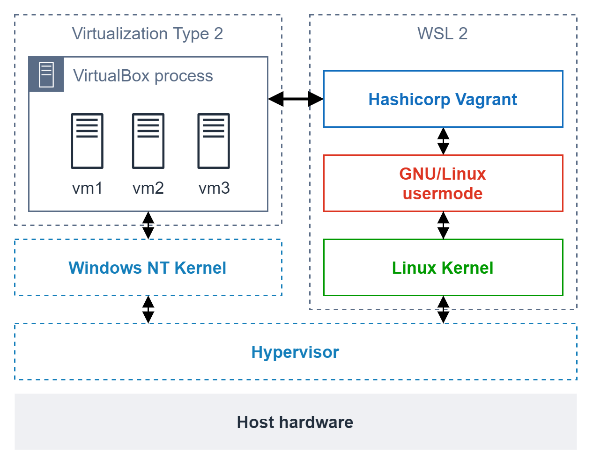

- Vagrant必须安装在 Linux (WSL 2) 上。



VirtualBox 
Vagrant 
Vagrant 插件：virtualbox_WSL2

```bash
# run inside WSL 2
# check https://www.vagrantup.com/downloads for more info
curl -fsSL https://apt.releases.hashicorp.com/gpg | sudo apt-key add -
sudo apt-add-repository "deb [arch=amd64] https://apt.releases.hashicorp.com $(lsb_release -cs) main"
sudo apt-get update && sudo apt-get install vagrant


# append those two lines into ~/.bashrc
echo 'export VAGRANT_WSL_ENABLE_WINDOWS_ACCESS="1"' >> ~/.bashrc
echo 'export PATH="$PATH:/mnt/c/Program Files/Oracle/VirtualBox"' >> ~/.bashrc

# now reload the ~/.bashrc file
source ~/.bashrc
```


https://stackoverflow.com/questions/65001570/connection-refused-in-vagrant-using-wsl-2?ref=blog.thenets.org
```
# Install virtualbox_WSL2 plugin
vagrant plugin install virtualbox_WSL2
```