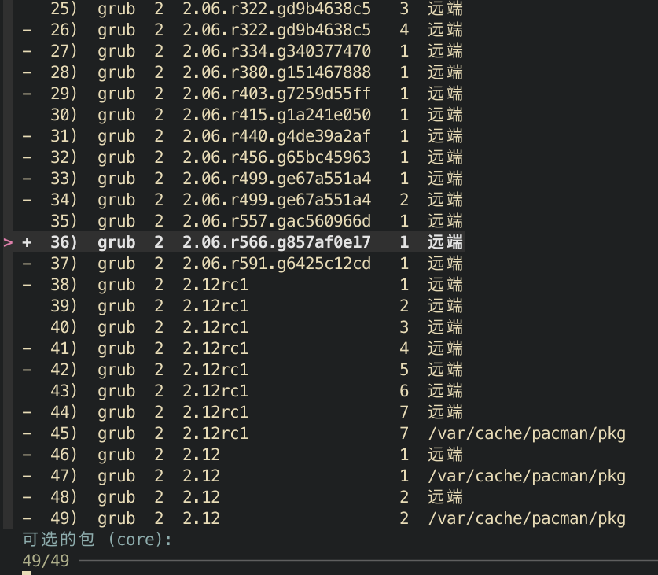

## 起因
我在 Arch Linux 上一次平平无奇的滚动更新，破坏了 grub 无法正常引导系统。

虽然我做了 btrfs 快照并利用 grub-btrfs 来实现在引导界面可以启动到任意快照的能力，让我避免了几次滚挂和误删数据，但这次引导直接故障，让我心里一慌。

初步思路是重建 grub 引导并生成配置，但实际上却一波三折，下面让我将修复过程细细道来。
<!-- truncate -->

## 修复

准备好 Arch Linux LiveCD，这里我用的 [Ventoy](https://ventoy.net/) 避免了重复烧录。

进入 LiveCD 后，挂载我们的 Arch Linux 所在的盘符和 /boot 引导分区所在的盘符。

这里我用的 btrfs 文件系统 存在一个子卷（sub volume）概念，需要添加额外的参数。

```bash
lsblk
# 挂载根目录到/mnt @为子卷名称，留空默认为根。
mount -t btrfs -o subvol=@  /dev/nvme0n1p2 /mnt  
#挂载home目录到/mnt/home(可选)
mount -t btrfs -o subvol=@home  /dev/nvme0n1p2 /mnt/home 
# 挂载EFI分区到/mnt/boot/efi
mount /dev/nvme0n1p1 /mnt/boot     
```
然后 chroot 一下，注意 archlinux 需要使用 arch-chroot
```bash
arch-chroot /mnt
```

参考 [Arch Wiki GRUB](https://wiki.archlinux.org/title/GRUB) 重建引导

```bash
grub-install --target=x86_64-efi --efi-directory=/boot/efi --bootloader-id=GRUB
grub-mkconfig -o /boot/grub/grub.cfg
```

退出chroot环境：

```bash
exit  
umount -R /mnt 
reboot 
```


结果，重新启动后，GRUB 提示`Minimal BASH-like line editing is supported....`

经过查阅 [reddit](https://www.reddit.com/r/archlinux/comments/16s16fx/minimal_bash_like_line_editing_problem_but_not/) 和 [archlinux](https://bbs.archlinux.org/viewtopic.php?id=257358) 社区后决定使用 `grub> configfile /grub/grub.cfg` 试一下。

发现存在 `/grub/grub.cfg` 和 `/grub/grub.cfg.new`前者为空，只好重新进入 LiveCD 进行修改。

这时候可以使用正确的 `/grub/grub.cfg` 进行引导加载了，在我以为结束时，GRUB 提示 `Latest grub bricked my system (grub_is_shim_lock_enabled not found)`。紧接着在 endeavouros 社区里找到了[相关讨论](https://forum.endeavouros.com/t/latest-grub-bricked-my-system-grub-is-shim-lock-enabled-not-found/42879/5)，大意是 grub 新版本引入了一些破坏性的更新，降级即可解决。


于是我再次进入 LiveCD 执行 `downgrade grub` 选中历史版本，完成降级。



降级过程中，由于在 liceCD 中 timeshift 未运行，导致 timeshift-autosnap 对应的 pacman hook 失败，所以决定临时卸载 timeshift-autosnap ，等降级后成功进入系统后再重新安装即可。
