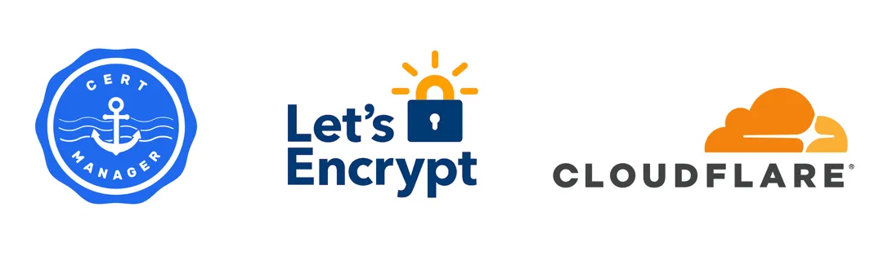

import Tabs from '@theme/Tabs';
import TabItem from '@theme/TabItem';

Cert-Manager 是 Kubernetes 上的全能证书管理工具，本文将介绍如何使用 Cert-Manager 的 ACME Issuer 进行申请免费证书并为证书自动续期。  

<!-- truncate -->

## 传统的证书申请流程
在开始前我们先复习一下传统的证书申请流程，通常包括以下几个步骤：

1. 当为服务器或网站申请 SSL/TLS 证书时，需要先生成一对密钥（公钥和私钥）。
2. 然后创建一个证书签名请求（Certificate Signing Request, CSR），CSR 中包含了公钥以及证书的主题信息，如组织名称、域名等。CSR是未签名的，它需要被CA签名以证明其有效性。
3. 再将 CSR 提交给证书颁发机构（Certificate Authority, CA），CA 在验证你的身份和域名所有权之后，使用它的私钥来签名你的 CSR，生成一个 SSL/TLS 证书。这个过程涉及到用 CA 的私钥加密你 CSR 中的信息的哈希值，生成的加密哈希就是签名。
4. 关于签名的验证：当用户的浏览器连接到你的安全网站时，它会接收到你的证书，并使用 CA 的公钥来验证签名。如果 CA 的公钥能成功解密签名并且得到的哈希值与证书信息的哈希值相匹则证明连接是安全的。

## Cert-Manager 证书生命周期

Cert-Manager 是一个非常简单的工具，用户只需两步即可获得证书，极大的简化了繁琐的操作。

- 第一步：定义颁发证书的颁发者（Issuer/ClusterIssuer）。
  > **Issuer** 只能用来签发自身所在 namespace 下的证书  
  >
  > **ClusterIssuer** 可以签发任意 namespace 下的证书。  
- 第二步：创建 Certificate 对象向该颁发者请求证书。
  > **Certificate** 用于向 Cert-Manager 传递域名证书的信息、签发证书所需要的配置，以及对 Issuer/ClusterIssuer 的引用。  
  >
  > 可以手动创建 Certificate ，也可以通过 ingress 资源的 annotation 来自动创建。  


简而言之，先创建 Issuer 定义证书的颁发者，在创建 Certificate 证书对象，一旦创建了 Certificate 证书对象，它就会创建一个 Certificate Request 证书请求，并告诉 Cert-Manager 使用关联的 Issuer 为请求的域颁发证书。然后，Issuer 将创建 Order 订单和 Challenge 质询以满足请求。Order 将管理此证书的 ACME 订单的生命周期。[官方文档](https://cert-manager.io/docs/concepts/certificate/#certificate-lifecycle)解释证书的生命周期非常清楚。


```
                      ┌──────────┐                         ┌─────────────┐
                      │          │                         │             │
       ┌──────────────►  Issuer  ├────────────┐        ┌───►  Challenge  │
       │              │          │            │        │   │             │
       │              └──────────┘            │        │   └─────────────┘
       │                                      │        │
┌──────┴────────┐                        ┌────▼────┐   │   ┌─────────────┐
│               │                        │         │   │   │             │
│  Certificate  │                        │  Order  ◄───┼───►  Challenge  │
│               │                        │         │   │   │             │
└──────▲────────┘                        └────┬────┘   │   └─────────────┘
       │                                      │        │
       │        ┌───────────────────────┐     │        │   ┌─────────────┐
       │        │                       │     │        │   │             │
       └───────►│   CertificateRequest  ◄─────┘        └───►  Challenge  │
                │                       │                  │             │
                └───────────────────────┘                  └─────────────┘
```

## 安装 Cert-Manager
版本列表：https://cert-manager.io/docs/releases/

我们使用下面的命令来安装证书管理器，它创建命名空间 cert-manager，安装 CRD 并将名称服务器设置为 8.8.8.8:53\,1.1.1.1:53DNS01 验证。
> 8.8.8.8这是 Google 的 DNS 服务器，1.1.1.1是 Cloudflare 的 DNS 服务器
```bash
helm upgrade --install cert-manager cert-manager \
  --repo https://charts.jetstack.io \
  --namespace cert-manager \
  --create-namespace \
  --version v1.14.2 \
  --set installCRDs=true \
  --set 'extraArgs={--dns01-recursive-nameservers-only,--dns01-recursive-nameservers=8.8.8.8:53\,1.1.1.1:53}'

```
让我们等待所有部署完成。
```bash
kubectl get deploy -o name -n cert-manager | xargs -n1 -t kubectl rollout status -n cert-manager
```
安装 cert-manager 后，您需要配置的第一件事是创建 ClusterIssuer 或 Issuer。这些资源表示能够对证书进行签名以响应证书签名请求的证书颁发机构 （CA）。下面让我们来看看如何创建它们吧。

## 什么是 ACME

[ACME](https://en.wikipedia.org/wiki/Automatic_Certificate_Management_Environment) (Automated Certificate Management Environment (ACME) Certificate Authority server) 证书自动化申请与管理协议。
 
### ACME 免费提供商
  - Let's Encrypt: 三个月有效期的免费证书。一个星期内只为同一个域名颁发 5 次证书。免费证书有效期只有90天，需在到期前再校验一次实现续期。
  - ZeroSSL: 不限数量的三个月有效期的免费证书，也支持多域名证书与泛域名证书。 还提供了一个额外的 Dashboard 查看与管理所有申请的证书。
  - Buypass：三个月有效期的免费证书。

    | free ACME    | production ACME directory URLs                 |
    | ------------ | ---------------------------------------------- |
    | Let’sEncrypt | https://acme-v02.api.letsencrypt.org/directory |
    | Buypass      | https://api.buypass.com/acme/directory         |
    | ZeroSSL      | https://acme.zerossl.com/v2/DV90               |


### ACME 校验方式

ACME CA 服务器用来验证客户端是否有权申请特定域名证书的过程被称为质询(challenges) ，用来防止非域名持有者申请并获取证书来冒充网站。

按照 [RFC8555](https://datatracker.ietf.org/doc/html/rfc8555#section-8.3) 的规定 ACME 校验域名归属的两种方式分别是 **HTTP-01** 和 **DNS-01**，详情可参见 [验证方式](https://letsencrypt.org/zh-cn/docs/challenge-types/)。  

- HTTP-01 验证要求在你的网站上放置特定的验证文件，证明你对该域名有控制权。
  - HTTP-01 要求 ACME 能够访问到你的服务器的 80 端口，如果不暴露公网或不使用此端口则不能使用此方法。用法详见 [Configuring the HTTP01 Ingress solver](https://cert-manager.io/docs/configuration/acme/http01/#configuring-the-http01-ingress-solver)

- DNS-01 验证则需要你在域名系统（DNS）中添加特定的记录，也是用来证明域名的拥有权。
  - DNS-01 DNS 提供商众多，Cert-Manager 内置部分 DNS 提供商的支持，详细列表和用法详见 [Supported DNS01 providers](https://Cert-Manager.io/docs/configuration/acme/dns01/#supported-dns01-providers)。

若需要使用非 Cert-Manager 内置的 DNS 提供商，可参考以下两种方案：

1. 设置 Custom Nameserver  
在 DNS 提供商后台设置 custom nameserver，指向例如 cloudflare 此类可管理其它 DNS 提供商域名的 nameserver 地址。这样配置 Issuer 指定 DNS-01 验证时，添加 cloudflare 的信息即可。  
修改 Nameserver 也是保证域名迁移期间解析可用的常见做法，如果你做过一定不会陌生。
1. 使用 Webhook
使用 Cert-Manager 的 Webhook 来扩展 Cert-Manager 的 DNS-01 验证所支持的 DNS 提供商，已经有许多第三方实现，包括国内常用的 DNSPod 与阿里 DNS，详细列表和用法请参见 [Webhook](https://Cert-Manager.io/docs/configuration/acme/dns01/#webhook)。


:::tip
DNS-01 验证是我经常使用的方法。使用此方法有两个主要原因：
- 无需担心防火墙、负载均衡器、代理等，它们可能会阻止 http 验证。
- 支持申请通配符证书。
:::

## 创建 Issuer 


下面开始使用 Cloudflare 提供的 DNS 解析服务，实现通过 DNS-01 质询方式申请证书。

您需要从 Cloudflare 获取 API token。登录 [Cloudflare控制面板](https://dash.cloudflare.com/) ，打开 [API Tokens](https://dash.cloudflare.com/profile/api-tokens) 页面，按照 [cert-manager文档](https://cert-manager.io/docs/configuration/acme/dns01/cloudflare/#api-tokens) 中的说明，创建一个 API Token ，记录该 API Token 的值填入下方。

```yaml
---
apiVersion: v1
kind: Secret
metadata:
  name: cloudflare-api-token-secret
  # namespace: cert-manager
  # 如果创建 ClusterIssuer 则需要将其放在 cert-manager namespace 下面
type: Opaque
stringData:
  api-token: <Cloudflare API token>
---
apiVersion: cert-manager.io/v1
# kind: ClusterIssuer
kind: Issuer
metadata:
  name: <Issuer Name>
spec:
  acme:
    email: <Your Email>
    # 生产环境
    # server: https://acme-v02.api.letsencrypt.org/directory
    # 演练环境使用Staging环境 注意：curl会提示 curl: (60) SSL 不用担心浏览器访问是没问题的。切换到生产环境就会解决。
    server: https://acme-staging-v02.api.letsencrypt.org/directory
    privateKeySecretRef:
      name: cluster-issuer-account-key
    solvers:
      - dns01:
          cloudflare:
            apiTokenSecretRef:
              name: cloudflare-api-token-secret
              key: api-token
```

```bash
❯ kubectl apply -f - << EOF   
...
...
EOF

NAME                                 TYPE     DATA   AGE
secret/cloudflare-api-token-secret   Opaque   1      31s

NAME                                              READY   AGE
clusterissuer.cert-manager.io/cloudflare-issuer   True    31s
```
:::tip
- email：请在此处使用真实的电子邮件，因为某些 CA 不允许虚假电子邮件，并且当您的证书即将到期时，他们会与您联系。
- server：ACME 目录 URL。有关免费 CA ACME 目录 URL 的列表见[ACME 免费服务提供商](#acme-免费提供商)。
- privateKeySecretRef：
    在Cert-manager中，这个由privateKeySecretRef指定的Secret扮演了存储TLS私钥的角色。

    这个Secret可以是手动创建的，如果没有提前创建对应的Secret，Cert-manager会自动生成一个新的Secret来存储私钥

    私钥有何用途？
    - 证书签发：当你请求一个新的证书时，Cert-manager会使用这个私钥来生成一个证书签名请求（Certificate Signing Request, CSR）。CSR会发送给你选择的证书颁发机构（CA），CA会验证CSR的信息，并用它们的根证书对你的公钥进行签名，从而生成你的TLS证书。
    - TLS加密：在TLS握手过程中，私钥用于加密信息，确保只有对应的公钥持有者才能解密，从而实现安全通信。公钥包含在TLS证书中，而私钥应当保密，不被外界知晓。
    - 如有疑问请复习[传统的证书申请流程](#传统的证书申请流程)。

- disableAccountKeyGeneration（可选）：如果您有要重用的现有帐户密钥，请将其设置为 true 。
- External Account Binding（可选）：外部帐户绑定，大多数商业 CA 倾向于对其 ACME 服务器使用外部帐户绑定。如果您使用的 CA（Sectigo、ZeroSSL、Digicert 等）需要它，请按照官方文档添加它。
:::


我希望您在阅读上述内容后知道您将使用哪种类型的发行人以及如何定义发行人issuer 。我们将在下一部分开始请求证书。


## 申请 Certificate
可以通过手动创建或基于注解自动创建Certificate资源，cert-manager会自动管理签发证书并保存至指定的Secret对象中，并自动管理续期。

### 手动创建

申请证书最可靠的方法是手动创建Certificate资源。证书请求失败的原因太多了，我需要在使用证书之前确保证书存在，所以通常会通过手动创建Certificate资源


首选，创建一个Certificate对象，这会触发spec.issuerRef字段指定的Issuer或ClusterIssuer签发TLS证书。证书颁发后，将存储在spec.secretName字段指定的Secret对象中。


```yaml
apiVersion: cert-manager.io/v1
kind: Certificate
metadata:
  name: example-example-com
spec:
  dnsNames:
  - 'example.example.com'
  issuerRef:
    kind: ClusterIssuer
    name: cloudflare-acme-cluster-issuer
  secretName: lts-example-example-com
```

<details>
<summary>更多Certificate示例</summary>

如果您想了解更多关于可以在证书资源上使用哪些选项的信息，请在查看 [手动签发证书](https://Cert-Manager.io/docs/usage/certificate/#creating-certificate-resources) 和 [v1.CertificateSpec](https://cert-manager.io/docs/reference/api-docs/#cert-manager.io/v1.CertificateSpec)。

```yaml
apiVersion: Cert-Manager.io/v1
kind: Certificate
metadata:
  name: example-com
  namespace: default
spec:
  secretName: tls-example.com # 证书保存的 secret 名。Istio Gateway/Ingress/Gateway API 都可以通过直接引用这个 secret 来添加 TLS 加密。
  # The use of the common name field has been deprecated since 2000 and is
  # discouraged from being used.
  commonName: example.com
  privateKey:
    rotationPolicy: Always # renew 时总是重新创建新的私钥
    algorithm: ECDSA # RSA/ECDSA/Ed25519，其中 RSA 应用最广泛，Ed25519 被认为最安全
    encoding: PKCS1 # PKCS1/PKCS8 对于 TLS 加密，通常都用 PKCS1 格式
    size: 256 # RSA 默认为 2048，ECDSA 默认为 256，而 Ed25519 不使用此属性！
  usages:
    - server auth
    - client auth
  # At least one of a DNS Name, URI, or IP address is required.
  # I can add wildcard domain here because I use an issuer using dns01 method.
  dnsNames:
    - example.com
    - "*.example.com"
  isCA: false
  # Issuer references are always required.
  issuerRef:
    name: letsencrypt-prod-alidns
    kind: Issuer 
    group: Cert-Manager.io

  # secretTemplate is optional. If set, these annotations and labels will be
  # copied to the Secret named tls-example.com. These labels and annotations will
  # be re-reconciled if the Certificate's secretTemplate changes. secretTemplate
  # is also enforced, so relevant label and annotation changes on the Secret by a
  # third party will be overwriten by Cert-Manager to match the secretTemplate.
  secretTemplate:
    annotations:
      my-secret-annotation-1: "foo"
      my-secret-annotation-2: "bar"
    labels:
      my-secret-label: foo

  duration: 2160h # 90d
  renewBefore: 360h # 15d
  # https://Cert-Manager.io/docs/reference/api-docs/#Cert-Manager.io/v1.CertificatePrivateKey

  # uris:  # 如果想在证书的 subjectAltNames 中添加 URI，就补充在这里
  #   - spiffe://cluster.local/ns/sandbox/sa/example
  # ipAddresses:  # 如果想在证书的 subjectAltNames 添加 ip 地址，就补充在这里
  #   - 192.168.0.5
  subject:
    # 证书的补充信息
    # 字段索引：https://Cert-Manager.io/docs/reference/api-docs/#Cert-Manager.io/v1.X509Subject
    organizations:
      - xxx
```
</details>


我们可用配置Ingress使用指定的Secret实现TLS。
```bash
kubectl create deployment hello-cert --image=hashicorp/http-echo -- /http-echo -listen=:5678 -text="Hello Cert"
kubectl expose deployment hello-cert --type=ClusterIP --name=hello-cert-svc --port=80 --target-port=5678
kubectl create ingress hello-cert --class=nginx --rule="hello-cert.cloudnative.love/*=hello-cert-svc:80,tls=lts-hello-cert.cloudnative.love"
```
此时配置一下 DNS 后浏览器访问即可验证成功，注意如果使用letsencrypt的演练环境curl是无法验证证书的，需要使用生产环境的地址。


### Ingress 注解
申请证书最常用的方法是添加 Ingress Annotation ，然后让 Cert-Manager 为您完成剩下的工作。

添加Ingress注解指定Issuer/ClusterIssuer后，Cert-Manager 将创建一个 Certificate 对象，并触发指定的Issuer/ClusterIssuer签发TLS证书，并保存至spec.tls[*].secretName字段指定的Secret对象中。

- 注解指定 issuer 

如果不想指定要用于证书的私钥类型，则唯一需要的注释是 cert-manager.io/cluster-issuer/cert-manager.io/issuer。

```bash
kubectl annotate ingress <ingress_name> cert-manager.io/cluster-issuer=<cluster_issuer_name>
```
- 注解添加 自动续期(可选)

当 kubernetes.io/tls-acme 设置为 "true" 时，ACME 证书管理器会自动处理证书的获取和续订。证书到期时，ACME 证书管理器将自动执行续订操作，而当此选项被禁用时，证书只会在创建时自动申请，但到期时不会自动续期。

```bash
kubectl annotate ingress <ingress_name> kubernetes.io/tls-acme: "true"
```

- 注解添加 ECC 证书和强制密钥轮换(可选)
建议使用 ECC 私钥，并强制轮换新证书的密钥。您可以通过向入口对象添加另外 3 个注释来轻松完成。
```bash
kubectl annotate ingress httpbin-route cert-manager.io/private-key-algorithm=ECDSA
kubectl annotate ingress httpbin-route cert-manager.io/private-key-size=256
kubectl annotate ingress httpbin-route cert-manager.io/private-key-rotation-policy=Always
```

生成的 yaml 示例如下

```yaml
apiVersion: networking.k8s.io/v1
kind: Ingress
metadata:
  name: example-ingress
  annotations:
    cert-manager.io/cluster-issuer: "<cluster_issuer_name>"
    kubernetes.io/tls-acme: "true"
    cert-manager.io/private-key-algorithm: ECDSA
    cert-manager.io/private-key-rotation-policy: Always
    cert-manager.io/private-key-size: "256"
...    
  tls:
  - hosts:
    - example.example.com
    secretName: test-example.example.com
```

要了解更多 ingress annotations 信息，请在此处查看[supported-annotations](https://cert-manager.io/docs/usage/ingress/#supported-annotations)。


## 排错 & HandBook

如果发现证书长时间未 Ready，可以参考[故障排除指南](https://cert-manager.io/v1.9-docs/faq/troubleshooting/) [颁发 ACME 证书故障排除](https://cert-manager.io/v1.9-docs/faq/acme/)按证书申请流程进行逐层排查。

```bash
# checking your certificate
kubectl get secrets --field-selector type=kubernetes.io/tls -A 

# get certificate info
kubectl get secret ${secret_name} -o jsonpath='{.data.tls\.crt}' | base64 -d | openssl x509 -text
kubectl get secret ${secret_name} -o jsonpath='{.data.tls\.key}' | base64 -d | openssl rsa -text
openssl s_client -connect example.example.com:443

# secert 定义
kubectl create secret generic cloudflare-api-token-for-external-dns -n external-dns \
--from-literal=cf-api-token=aaa \
--from-literal=zone-id=bbb \
--from-literal=domain=ccc --dry-run=client -oyaml 

# secert 查看
kubectl get secret cloudflare-api-token-for-external-dns -n external-dns -o json | jq -r '.data["api-token"]' | base64 --decode
kubectl get secret cloudflare-api-token-for-external-dns -n external-dns -o json | jq -r '.data | map_values(@base64d)' 

# troubleshooting
kubectl get Issuers,ClusterIssuers,Certificates,CertificateRequests,Orders,Challenges 
kubectl describe challenges.acme.cert-manager.io
kubectl describe orders.acme.cert-manager.io

# tip
kubectl label namespace cert-manager certmanager.k8s.io/disable-validation=true #标记 cert-manager 命名空间以禁用资源验证

# curl
# curl -kL --resolve www.example.com:80:ip http://www.example.com'
# curl -kivL -H 'Host: www.example.com' 'http://ip
```


<!-- - https://tech.aufomm.com/how-to-use-cert-manager-on-kubernetes/#ACME
- https://www.bilibili.com/video/BV1qa411V7xs/
- https://thiscute.world/posts/kubernetes-cert-management/
- https://cloud.tencent.com/document/product/457/49368
- https://todoit.tech/k8s/cert/

ali  
- https://github.com/PowerDos/k8s-cret-manager-aliyun-webhook-demo
- https://lxh.io/post/2022/kubenetes-aliyun-https/
- https://www.cnblogs.com/zisefeizhu/p/13478746.html
- https://blog.ysicing.net/posts/cert-manager-install

vault  
- https://developer.hashicorp.com/vault/tutorials/kubernetes/kubernetes-cert-manager

证书 
- https://tech.aufomm.com/a-complete-guide-of-using-ssl-server-certificate-with-traefik-on-docker/#CA-ACME-directory-URLs
- 注意变更 https://cert-manager.io/docs/installation/upgrading/ingress-class-compatibility/#background
- 扩展阅读 https://blog.cloudflare.com/automated-origin-ca-for-kubernetes -->

