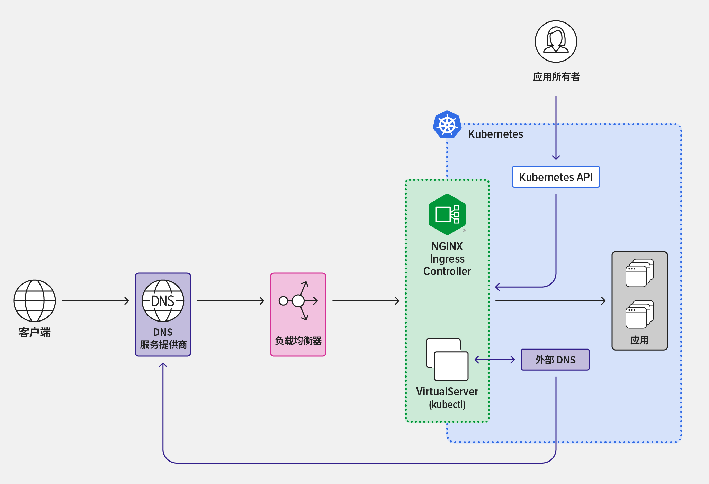

External-DNS 简化了 DNS 记录的管理，它通过监视 Kubernetes 资源，并利用外部 DNS 提供商来配置相应的 DNS 记录。

本文介绍如何部署 External-DNS ，并通过示例验证其功能特性。
<!-- truncate -->

## 什么是 External-DNS 

External-DNS 通过给 ingress、service [等资源](https://github.com/kubernetes-sigs/external-dns/tree/master/charts/external-dns#support-matrix) 添加注解的方式，自动给外部 DNS 提供商添加 DNS 记录。



ExternalDNS会很好的解决了下面的问题：

- 创建了很多的 ingress，但是这些 ingress 的解析需要你手动在你 dns 提供商中同步
- 创建了很多的 svc，有时候这些 svc 的 ip 是动态的，你需要有一个东西去做同步
- 修改了 ingress controller 的 ip，你需要修改大量的dns 解析

external-dns可以根据txt记录判断是否为自己创建的dns记录。如果是自己创建的，当资源在 Kubernetes 中被移出时则会在dns提供商里删除这个记录。

## 安装

我们要准备 cloudflare 的密钥，不推荐使用全局的 API_KEY，推荐使用 API_TOKEN，打开页面 [User API Tokens](https://dash.cloudflare.com/profile/api-tokens)，创建权限为 `Zone:Read`， `DNS：Edit` 的 token，并记录下来。

打开 cloudflare domain 域名页面，在右侧下拉找到 zone-id 将其记录下来。

下面我们创建 secret，填入前面记录的值。

```bash
kubectl create secret generic cloudflare-api-token-for-external-dns-secret -n external-dns \
--from-literal=cf-api-token="<your-cd-api-token>" \
--from-literal=zone-id="<your-zone-id>" \
--from-literal=domain="<your-domain>" --dry-run=client -oyaml 
```

部署 helm 前先创建自定义 valuse 文件
```bash
extraArgs:
  - --domain-filter=$(DOMAIN)
  - --zone-id-filter=$(ZONE_ID) # (optional) limit to a specific zone. It’s in the Overview tab for that domain. Right hand column in the API section. Scroll down a bit.
  - --cloudflare-proxied # (optional) enable the proxy feature of Cloudflare (DDOS protection, CDN...)
  - --cloudflare-dns-records-per-page=5000 # (optional) configure how many DNS records to fetch per request 增大单词请求数据量减少请求次数
# - --namespace=$(POD_NAMESPACE)   #只会处理该命名空间中的Ingress/Service资源。
# - --source=service #默认已有无需重复添加
# - --source=ingress #默认已有无需重复添加
# - --provider=cloudflare #此参数需要 通过 provider 来定义。
policy: sync #默认upsert-only不允许删除记录
provider:
  name: cloudflare
env:
  - name: CF_API_TOKEN
    valueFrom:
      secretKeyRef:
        name: cloudflare-api-token-for-external-dns-secret
        key: cf-api-token
  - name: DOMAIN
    valueFrom:
      secretKeyRef:
        name: cloudflare-api-token-for-external-dns-secret
        key: domain
  - name: ZONE_ID
    valueFrom:
      secretKeyRef:
        name: cloudflare-api-token-for-external-dns-secret
        key: zone-id
```

执行下面命令完成安装
```bash
helm upgrade --install external-dns external-dns \
  --repo https://kubernetes-sigs.github.io/external-dns/ \
  --namespace external-dns \
  --create-namespace \
  --version 1.14.3 \
  -f values.yaml
```

## External-DNS 结合 CertManager 

External-DNS 结合 CertManager，实现全自动的dns配置和证书签发，下面为演示案例。

>关于 CertManager 的使用可以参考 [早期的博客](http://localhost:3000/blog/2022/03/18/%E5%A6%82%E4%BD%95%E5%9C%A8%20Kubernetes%20%E4%BD%BF%E7%94%A8%20Cert-Manager%20%E7%AE%A1%E7%90%86%E8%AF%81%E4%B9%A6/README)

```bash
# 创建例子
kubectl create deployment hello-cert-annotation --image=hashicorp/http-echo -- /http-echo -listen=:5678 -text="Hello Cert Annotation"
kubectl expose deployment hello-cert-annotation --type=ClusterIP --name=hello-cert-annotation-svc --port=80 --target-port=5678
kubectl create ingress hello-cert-annotation --class=nginx --rule="hello-cert-annotation.cloudnative.love/*=hello-cert-annotation-svc:80,tls=lts-hello-cert-annotation.cloudnative.love"
# 添加certmanager注解
kubectl annotate ingress hello-cert-annotation cert-manager.io/cluster-issuer=cluster-issuer-cloudflare-letsencrypt-staging
# 添加External-DNS注解
kubectl annotate ingress hello-cert-annotation external-dns.alpha.kubernetes.io/hostname=$(kubectl get ingress hello-cert-annotation -o jsonpath='{.spec.tls[0].hosts[0]}') --overwrite
kubectl annotate ingress hello-cert-annotation external-dns.alpha.kubernetes.io/ttl="120" #optional
kubectl annotate ingress hello-cert-annotation external-dns.alpha.kubernetes.io/cloudflare-proxied="false"
```
注意私网地址是无法享受 cloudflare-proxied ，所以这里我关闭了。

<!-- - https://medium.com/@karrier_io/externaldns-automatic-dns-management-on-kubernetes-4fd71c6a4387
- https://github.com/kubernetes-sigs/external-dns/blob/master/docs/tutorials/cloudflare.md

- https://imliuda.com/post/1234#%E9%83%A8%E7%BD%B2external-dns
- https://www.bboy.app/2023/08/10/%E4%BD%BF%E7%94%A8external-dns%E8%87%AA%E5%8A%A8%E5%9C%A8dnspod%E4%B8%8A%E6%B7%BB%E5%8A%A0dns%E8%AE%B0%E5%BD%95/
cd
- https://geek-cookbook.funkypenguin.co.nz/kubernetes/external-dns/
- https://www.pulumi.com/ai/answers/8WX3fU3MfsYcPvdJVeZPoe/integrating-kubernetes-with-cloudflare-using-externaldns -->