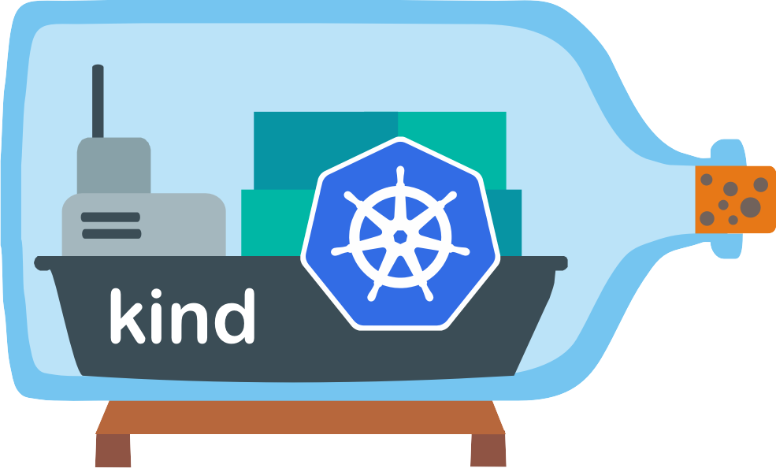

现在安装 Kubernetes 集群已经变得越来越简单了，Kubernetes in Docker（KinD）这个工具就可以通过创建容器来作为 Kubernetes 的节点，我们只需要在机器上安装 Docker 就可以使用，它允许我们在很短的时间内就启动一个多节点的集群，而不依赖任何其他工具或云服务商。

本文将介绍 [Kind](https://kind.sigs.k8s.io/) 中 extra-port-mappings，kubernetes-version，image-registry，api-server-acl 等基本配置。
并带有一个 [kubesphere](https://kubesphere.io/) 部署示例，还演示了在不删除 Kind 集群的情况下的暂停和重启，以及 Kind 开启 IPVS 导致相关错误的排查记录。

<!-- truncate -->

## RTFM
在开始之前我们需要读一下相关文档。
- 指定具体的集群版本可以查看 [kubernetes-version](https://kind.sigs.k8s.io/docs/user/configuration/#kubernetes-version) 。
- 默认情况下你无法访问 Kind 集群的 nodeport 你需要通过 [nodeport with port mappings](https://Kind.sigs.k8s.io/docs/user/configuration/#extra-port-mappings) 添加外部端口映射到宿主机。
- 出于安全原因默认情况下 Kind 部署的 api-server 仅允许 127.0.0.1 访问，你可以参考 [api-server](https://kind.sigs.k8s.io/docs/user/configuration/#api-server) 进行更改，如改为宿主机 IP 实现外部访问 。
  ```bash title="否则你将收到报错"
  The connection to the server {YourIP}:6443 was refused - did you specify the right host or port?
  ```
- 手动指定仓库地址 [image-registry](https://kind.sigs.k8s.io/docs/user/local-registry/) 。
- 参考 [kubeadm-config-patches](https://kind.sigs.k8s.io/docs/user/configuration/#kubeadm-config-patches) 可以对 kubeadm 进行额外的参数调整 

## 新建 Kind 集群

**Kind 配置文件参考 [kubesphere.yaml](./kubesphere.yaml)**

import CodeBlock from '@theme/CodeBlock';
import Source from '!!raw-loader!./kubesphere.yaml';

<CodeBlock language="yaml" title="kubesphere.yaml">{Source}</CodeBlock>

**创建集群**

```bash
kind create cluster --name kubesphere --config kubesphere.yaml
```

**删除集群**

```
kind delete  cluster --name kubesphere
```

## 测试用例

这里我们对 NodePort 进行一个简单地测试，看看是否能正常访问。

创建测试 pod
```bash 
kubectl run nginx-demo  --image nginx --port 80
```

创建 NodePort 类型的 Service ，并指定 `nodePort: 30080` 

```yaml title="kubectl expose pod nginx-demo --type NodePort --port 80 --target-port 80  --protocol TCP --dry-run=client -oyaml"
cat <<EOF | kubectl apply -f -
apiVersion: v1
kind: Service
metadata:
  creationTimestamp: null
  labels:
    run: nginx-demo
  name: nginx-demo
spec:
  ports:
  - port: 80
    protocol: TCP
    targetPort: 80
    # highlight-next-line
    nodePort: 30080
  selector:
    run: nginx-demo
  type: NodePort
status:
  loadBalancer: {}
EOF
```

在创建集群时候我们将 30080 映射到了本地的 80 端口，所以在本地使用 `curl -I http://localhost:80/` 来验证结果

```bash
❯ curl -I http://localhost:80/
HTTP/1.1 200 OK
Server: nginx/1.23.3
Date: Wed, 04 Jan 2023 03:49:50 GMT
Content-Type: text/html
Content-Length: 615
Last-Modified: Tue, 13 Dec 2022 15:53:53 GMT
Connection: keep-alive
ETag: "6398a011-267"
Accept-Ranges: bytes
```

## 部署 KubeSphere
[KubeSphere](https://kubesphere.io/) 安装十分简单。
:::tip 注意事项: 

- Kubernetes 版本要求 v1.19.x、v1.20.x、v1.21.x、* v1.22.x、* v1.23.x 和 * v1.24.x。带星号的版本可能出现边缘节点部分功能不可用的情况。
- Kubernetes 集群需存在默认的 StorageClass
- [参考安装文档](https://kubesphere.io/zh/docs/v3.3/quick-start/minimal-kubesphere-on-k8s/)
:::

我们本次实用的是 Kubernetes v1.21.14，而且 Kind 已经创建了一个默认的 StorageClass 来配置本地存储。

```bash
❯ kubectl get sc
NAME                 PROVISIONER             RECLAIMPOLICY   VOLUMEBINDINGMODE      ALLOWVOLUMEEXPANSION   AGE
standard (default)   rancher.io/local-path   Delete          WaitForFirstConsumer   false                  96m
```

我们符合准备工作的要求，下面让我们来安装 KubeSphere 吧
```bash
# 部署 KubeSphere
kubectl apply -f https://github.com/kubesphere/ks-installer/releases/download/v3.3.1/kubesphere-installer.yaml
kubectl apply -f https://github.com/kubesphere/ks-installer/releases/download/v3.3.1/cluster-configuration.yaml
# 查看安装日志
kubectl logs -n kubesphere-system $(kubectl get pod -n kubesphere-system -l 'app in (ks-install, ks-installer)' -o jsonpath='{.items[0].metadata.name}') -f
# 查看 Service 名字
kubectl get svc/ks-console -n kubesphere-system
```
你可以参考[启用热插拔组件](https://kubesphere.io/zh/docs/v3.3/pluggable-components/overview/)继续安装其他组件，这里不再赘述。

我们部署 Kind 时已将 NodePort 30880 映射到了宿主机 30880 端口，现在打开浏览器访问 `http://localhost:30880/` 既可。默认帐户 `admin` 默认密码 `P@88w0rd` 。

## Kind 集群状态查看

我们可以使用 [--format](https://docs.docker.com/config/formatting/) 来对结果进行格式化输出，使用 [--filter](https://docs.docker.com/engine/reference/commandline/ps/#filtering) 进行对结果进行过滤。

```bash
KIND_CLUSTER=kubesphere
# 列出 Kind cluster 容器列表
docker ps -a \
--format "table {{.ID}}\t{{.Image}}\t{{.Names}}\t{{.Status}}\t{{.Networks}}" \
--filter "label=io.x-k8s.kind.cluster=${KIND_CLUSTER}"
# 列出 Kind cluster 资源状态
docker stats   $(docker ps -q --filter "label=io.x-k8s.kind.cluster=kubesphere")
# 列出 Kind cluster 容器 IP
docker inspect $(docker ps -q --filter "label=io.x-k8s.kind.cluster=${KIND_CLUSTER}") \
--format='{{ printf "%-50s" .Name}} {{range .NetworkSettings.Networks}}{{.IPAddress}} {{end}}'
```
:::tip
注意本文 Kind 创建的集群名字为 `kubesphere` 请视情况更改变量 `${KIND_CLUSTER}` 。
可以通过 `kind get clusters` 和 `kubectl config get-clusters` 获取你正在使用的集群名字
```bash
❯ kind get clusters
kubesphere
❯ kubectl config get-clusters
NAME
kind-kubesphere
```
:::
## Kind 集群暂停与开启

创建集群后，是否可以在不删除集群的情况下停止并重新启动它？参考这个 [Issue](https://github.com/kubernetes-sigs/kind/issues/831)

```bash
KIND_CLUSTER=kubesphere
# 暂停容器 此时容器 STATUS 变为 (Paused)
docker pause $(docker ps -q --filter "label=io.x-k8s.kind.cluster=kubesphere")
# 取消暂停容器
docker unpause $(docker ps -q --filter "label=io.x-k8s.kind.cluster=kubesphere") 
```

## Troubleshooting
### IPVS 和 DNS 解析错误排查

参考 [issues/2326](https://github.com/kubernetes-sigs/kind/issues/2326)

在 Kind 中开启 `networking.kubeProxyMode: "ipvs"` 时，
```yaml title="Kind 部分配置截取"
networking:
  # highlight-next-line
  kubeProxyMode: "ipvs" 
```

部分 k8s 版本会出现无法初始化 node 错误，node 节点会一直卡在 `Starting kube-proxy`。

```bash
❯ kubectl describe node
Events:
  Type    Reason                   Age                From             Message
  ----    ------                   ----               ----             -------
  Normal  NodeHasSufficientMemory  15m (x8 over 15m)  kubelet          Node kubesphere-worker status is now: NodeHasSufficientMemory
  Normal  NodeHasNoDiskPressure    15m (x8 over 15m)  kubelet          Node kubesphere-worker status is now: NodeHasNoDiskPressure
  Normal  RegisteredNode           15m                node-controller  Node kubesphere-worker event: Registered Node kubesphere-worker in Controller
  Normal  Starting                 14m                kube-proxy       Starting kube-proxy.
  Normal  Starting                 33s                kubelet          Starting kubelet.
  Normal  NodeAllocatableEnforced  33s                kubelet          Updated Node Allocatable limit across pods
  Normal  NodeHasSufficientMemory  27s (x7 over 33s)  kubelet          Node kubesphere-worker status is now: NodeHasSufficientMemory
  Normal  NodeHasNoDiskPressure    27s (x7 over 33s)  kubelet          Node kubesphere-worker status is now: NodeHasNoDiskPressure
  Normal  NodeHasSufficientPID     27s (x7 over 33s)  kubelet          Node kubesphere-worker status is now: NodeHasSufficientPID
  # highlight-next-line
  Normal  Starting                 22s                kube-proxy       Starting kube-proxy.
```
这时候我们登录到 node 节点，正常情况下可以看见 IPVS 相关模块
```bash
❯ lsmod | grep ip | grep vs
ip_vs_sh               16384  0
ip_vs_wrr              16384  0
ip_vs_rr               16384  0
ip_vs                 172032  6 ip_vs_rr,ip_vs_sh,ip_vs_wrr
nf_nat                 45056  6 ip6t_MASQUERADE,ipt_MASQUERADE,xt_nat,openvswitch,nft_chain_nat,xt_REDIRECT
nf_conntrack          172032  11 xt_conntrack,nf_nat,ip6t_MASQUERADE,nfnetlink_cttimeout,ipt_MASQUERADE,xt_nat,openvswitch,nf_conntrack_netlink,nf_conncount,ip_vs,xt_REDIRECT
nf_defrag_ipv6         20480  3 nf_conntrack,openvswitch,ip_vs
libcrc32c              16384  6 nf_conntrack,nf_nat,openvswitch,nf_tables,xfs,ip_vs
```

若没有则需手动在所有节点上安装 IPVS

```bash
❯ apt-get update && apt-get install -y ipvsadm
❯ ipvsadm-save
```
并且可能伴随着无法解析 DNS 。
```bash
❯ kubectl run -i -t busybox --image=busybox --restart=Never --rm
If you don't see a command prompt, try pressing enter.
/ # ping wwww.baidu.com
ping: bad address 'wwww.baidu.com'
```
你还需要在 node 节点设置 `sysctl net.ipv4.conf.all.route_localnet = 1` 来解决 DNS 解析错误。

然后重启 Kind 容器。

### CNI 错误排查

当你在 Kind 中开启 `networking.disableDefaultCNI: true` 时意味着你需要手安装 CNI 插件

```yaml title="Kind 部分配置截取"
networking:
  # highlight-next-line
  disableDefaultCNI: true
```

在安装 CNI 插件之前 Node 状态为 NotReady 。

```bash
❯ kubectl get node
NAME                       STATUS     ROLES                  AGE    VERSION
kubesphere-control-plane   NotReady   control-plane,master   140m   v1.21.14
kubesphere-worker          NotReady   <none>                 139m   v1.21.14
❯ kubectl describe node kubesphere-worker
Conditions:
  Type             Status  LastHeartbeatTime                 LastTransitionTime                Reason                       Message
  ----             ------  -----------------                 ------------------                ------                       -------
  MemoryPressure   False   Wed, 04 Jan 2023 15:47:54 +0800   Wed, 04 Jan 2023 13:33:06 +0800   KubeletHasSufficientMemory   kubelet has sufficient memory available
  DiskPressure     False   Wed, 04 Jan 2023 15:47:54 +0800   Wed, 04 Jan 2023 13:33:06 +0800   KubeletHasNoDiskPressure     kubelet has no disk pressure
  PIDPressure      False   Wed, 04 Jan 2023 15:47:54 +0800   Wed, 04 Jan 2023 13:33:06 +0800   KubeletHasSufficientPID      kubelet has sufficient PID available
  # highlight-next-line
  Ready            False   Wed, 04 Jan 2023 15:47:54 +0800   Wed, 04 Jan 2023 13:33:06 +0800   KubeletNotReady              container runtime network not ready: NetworkReady=false reason:NetworkPluginNotReady message:Network plugin returns error: cni plugin not initialized
```