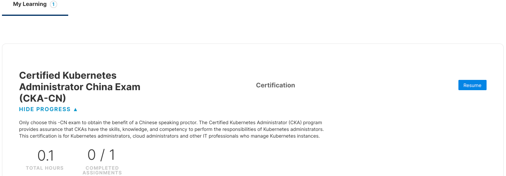
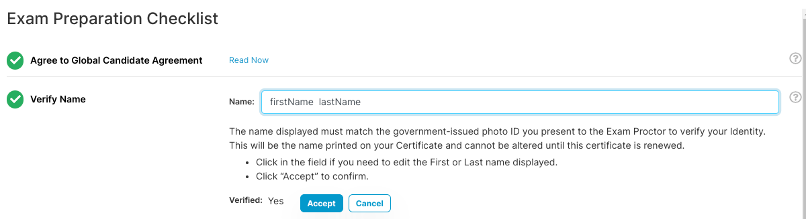

```mdx-code-block
<p align=""> 
  <a href="https://www.credly.com/badges/7f665fcf-c0a4-44e7-8b09-06584280dfc2">
    
  </a> 
  <a href="https://www.credly.com/badges/c37a3b97-5438-4c05-a28b-6ea2d6f38905">
    
  </a> 
  <a href="https://www.credly.com/badges/02d42601-dfd8-41de-a90b-6e1aba0c716d">
    
  </a> 
</p>
```
这里有考试 CKA CKAD CKS 省钱攻略，和对中国区参加考试的注意事项，以及开源的考前学习料哦~

哦对了，点击上面徽章就可以对我的证书进行验证哦~

<!-- truncate -->

## 关于购买考试券

### 购买地址：

- [Certified Kubernetes Administrator (CKA)](https://www.cncf.io/certification/cka/) 
- [Certified Kubernetes Security Specialist (CKS)](https://www.cncf.io/certification/cks/)
- [Certified Kubernetes Application Developer (CKAD)](https://www.cncf.io/certification/ckad/)
  
### 省钱技巧

- 网络星期一 (Cyber Monday)
  
  建议在每年的11月左右购买考试，你可以享受到一年一度的 `Cyber Monday` 可以帮你节省 **65%** 的费用

- 黑色星期五（Black Friday）

  在11月份还有 `Black Friday` 活动， 可以帮你节省 **35%** 的费用

- 优惠券
  
  Linux Foundation 会不定期放出一些优惠券。这里给大家列举了几个优惠券。
  - SCOFFER15
  - DCUBEOFFER
  - DEVOPS15DEVOPS15
  - [更多优惠券](https://couponbarrow.com/store/linux-foundation-coupons/?coupon_type=code)

- 捆绑购买

  捆绑购买结合 `Cyber Monday` 将节省一大半费用，强烈推荐！！

### 关于中国区考试

`Linux Foundation` 使用 `PSI`在线考试，无论购买那种语言进入考试系统后均可切换考试题的显示语言，目前支持 中文、英文、日文切换，但是考官语言无法更改。
当购买 CKA-CN、CKAD-CN、CKS-CN，中文试题后默认题目为中文，与考官发给你的消息会自动译为中文。

- [中国区考试购买地址](https://training.linuxfoundation.cn/) 

当你购买完成后会获得**考试激活码**，然后需要去 [linuxfoundation learn](https://trainingportal.linuxfoundation.org/learn/dashboard) 激活考试（申请考试，查看考试结果等都是这个链接，建议收藏到书签）。

:::tip
无论在哪里购买最后都是在 [linuxfoundation learn](https://trainingportal.linuxfoundation.org/learn/dashboard) 进行登记考试，[中国区考试购买地址](https://training.linuxfoundation.cn/)只提供激活码。

## 激活考试券
`CKA-CN` 购买后需要在 `个人中心-我的考试-查看考试券` 复制激活码到 [linuxfoundation learn](https://trainingportal.linuxfoundation.org/learn/dashboard)
点击 `Apply Registration Code` 输入进行激活。


:::

:::info 我遇到的奇怪问题
我买的 CKA-CN 在 Arch Linux 上安装 PSI 安全浏览器后却进入了英文考场。。。用英语和考官沟通示是否可以使用中文，考官表示英语是 PSI 系统选择的他不会说中文也没法更改。而且在核对身份时候多了一步他要求提供我的地址信息，后来因为网络卡了考官看不见我的相机串流画面，我就退出去重启了电脑换了科学网络，然后这次变为了中文考场。。。。。这可能是 PSI 浏览器在 Linux 上的 BUG 吧，初次安装后默认会进入英文考场。
这也说明了不同语言的考场核对信息流程可能会不一样。像 HashiCorp 的考试也用 PSI 系统，它们就把这些考前检查内容和 Linux Foundation 基本一致，但是需要自己上传图片和视频，考官只负责核对。 Linux Foundation 则是考官帮你录制上传，你只要按照考官的要求移动你的相机既可。这里建议有一个外置广角的相机，不然你就要抱着笔记本满世界转圈圈了。尽量让每个步骤的时间控制在 15s 内（HashiCorp 的考试 PSI 默认视频长度为 15 秒 应该都一样）。不然考官可能要求你重新录制周围环境。
:::

## 考试注意事项

大家在考试前按照流程仔细阅读相关手册。

- 候选人手册: [candidate-handbook](https://www.cncf.io/certification/candidate-han-dbook)

- 注意事项：[Important Instructions: CKA and CKAD](http://training.linuxfoundation.org/go/Important-Tips-CKA-CKAD)

- 常见问题：[faq-cka-ckad-cks](https://docs.linuxfoundation.org/tc-docs/certification/faq-cka-ckad-cks)

### 考纲和考试资料

下面是我找到的一些考试的资料，同时购买考试附赠的 killer.sh [模拟考试](#模拟考试)不要放过.

- 官方考试大纲： [github.com/cncf/curriculum](https://github.com/cncf/curriculum)

关于课程，我不建议买 Linux Foundation 出的课因为太贵了，非要购买的话推荐下面 udemy 的课程

- [Certified Kubernetes Administrator (CKA) with Practice Tests](https://www.udemy.com/course/certified-kubernetes-administrator-with-practice-tests/)
- [Kubernetes Certified Application Developer (CKAD) with Tests](https://www.udemy.com/course/certified-kubernetes-application-developer/)
- [Kubernetes CKS 2022 Complete Course - Theory - Practice](https://www.udemy.com/course/certified-kubernetes-security-specialist/)
  
:::tip
udemy 课程经常搞活动。如果你的帐号没有出现优惠券，你可以打开浏览器无痕模式然后换个公网IP再试试。上面的课程平均 10 美元左右不要买贵了哦。
:::

- **CKA 资料**
  - 推荐 https://github.com/walidshaari/Kubernetes-Certified-Administrator
  - 推荐 https://github.com/ahmetb/kubernetes-network-policy-recipes

    下面这些我没看过
    - https://github.com/ramitsurana/awesome-kubernetes
    - https://github.com/David-VTUK/CKA-StudyGuide
    - https://github.com/arush-sal/cka-practice-environment
    - https://github.com/alijahnas/CKA-practice-exercises
    - https://github.com/stretchcloud/cka-lab-practice
    - https://github.com/chadmcrowell/CKA-Exercises
    - https://github.com/kabary/kubernetes-cka/wiki
- **CKAD 资料**
  - 推荐 https://github.com/dgkanatsios/CKAD-exercises
  - 推荐 https://medium.com/bb-tutorials-and-thoughts/practice-enough-with-these-questions-for-the-ckad-exam-2f42d1228552
    
    下面这些我没看过
    - https://github.com/twajr/ckad-prep-notes
    - https://github.com/lucassha/CKAD-resources
    - https://github.com/StenlyTU/K8s-training-official
    - https://github.com/saripurigopi/CKAD
    - https://github.com/DStorck/cka-prep
- **CKS 资料**
  - 推荐 https://github.com/walidshaari/Certified-Kubernetes-Security-Specialist
  - 推荐 https://kubernetes-security.info/

- 其他人的经验
  - https://www.zhaohuabing.com/tags/cka/
  - https://www.reddit.com/r/kubernetes/comments/rzpu5i/i_just_passed_the_cka_here_are_some_tips_2022/
  - https://www.reddit.com/r/kubernetes/comments/s6l7xs/just_passed_the_cka_here_are_some_tips_and_tricks/
### 考试信息登记

[激活考试券](#激活考试券)后下拉页面进行考试信息登记



按照登记要求仔细阅读相关手册

:::tip
2022 年 6 月 25 日，Linux 基金会将 CKA、CKAD 和 CKS 程序从 PSI 的 ExamsLocal 监考平台迁移到PSI Bridge，因为考生收到了去年开始的通知，并提醒了上个月。考试内容没有变化。主要变化是候选人： 
+ 不再需要与监考人员共享桌面
+ 无需等待监考人员即可自行办理登机手续
+ 只能有一个活动监视器（内置或外置）
+ 现在将使用 PSI 安全浏览器而不是 Chrome
::: 

### 证件准备
认真阅读 [Linux 基金会全球认证和保密协议——4.1 候选人 ID 和对照片、视频和录音的同意](https://docs.linuxfoundation.org/tc-docs/certification/lf-cert-agreement#4-1-candidate-id-and-consent-to-photo-video-and-audio-recording)

:::tip 截取部分内容
>2022 年 8 月更新
>
>候选人需要提供符合以下要求的身份证明（ID）：
>
>+ 所有身份证件必须是政府签发的有效（未过期）**原件**（即非复印件）
>+ 身份证件必须包括候选人的姓名、照片和签名
>   + 政府签发的不包含签名的生物识别 ID 将被接受
>+ 身份证件上的名字和姓氏必须与 考试清单中输入的经过验证的姓名**完全一致**
>
>可接受的身份证件形式：
>+ 国际旅行护照
>+ 政府颁发的驾驶执照/许可证
>+ 政府签发的当地语言身份证（带照片和签名）
>+ 国民身份证 国家或省签发的身份证
>+ 外国人登记卡（绿卡或永久居民/签证）
>+ 住民基本台帐（附照片的住民基本台帐）或マイナンバーカード（个人编号卡）
:::

### 考试清单名字填写

打开考试清单填写页面



:::tip
显示的名称必须与您提交的政府发行的照片ID相匹配，以验证您的身份。这将是在您的证书上打印的名称，直到此证书续订后才能更改。
:::

:::info FAQ
**填写中文名还是英文名？**

按照官方的建议 `保证考试清单姓名和提供证件一致`。如果使用身份证要填写中文名，护照则填写英文名。

ps: 我使用身份证填写的中文名

**填写中文名考试证书会乱码嘛？**

考试清单名字填写格式：`firstName空格lastName`

正确格式如下
`Zhang San`
`Li Xiaosi`
`李 小四`
如果使用 `李小四` 则最后证书上面会变成 `. 李小四`
系统认为 `firstName` 不存在默认使用 `.` 代替导致
:::

### 模拟考试

在考试清单填写页面，可以看到考试附赠了你两次 `killer.sh` 模拟考试 [FAQ](https://killer.sh/faq)

点击 `Click here to access the Exam Simulator` 跳转到 [killer.sh](https://killer.sh/dashboard)

## 答题技巧

1. 多用命令生成资源和 yaml `--dry-run=client -o yaml`
2. 禁止优雅关闭加快删除 POD 时间 `--force --grace-period 0`
3. 使用explain 查询 Kubernetes 资源的声明参数
  - 如查询Pod的metadata 使用`--recursive`递归式列出所有参数
    -   `kubectl explain Pod.metadata --recursive`
4. 考试使用远程桌面，你不能像以前那样把书签提前存到浏览器，好在题中自带相关文档连接，只是个别有些不准，最好记住每个细节在文档中的位置。
5. 显示器越大越好，因为远程桌面只占你屏幕的三分之二，我17寸的笔记本屏幕感觉优点小体验不是很好。
6. 如果你不想举着笔记本转圈的话建议购买外置摄像头，注意要买可视角度大的，不然很不方便。
7. 你的考试带有一次免费补考，两次考试内容基本一致，所以你可以将不确定的题截取下来
  - Linux GDE 截屏快捷键 Alt+PrtScr ，建议 Gnome 在考试时候开启 `请勿打扰` 屏蔽系统通知，降低系统声音音量 `设置-声音-音量级别-系统声音` ，Linux 还要注意你的麦克风声音不要过噪。
  - windows 截屏快捷键 Win+PrtScr
  - MAC 截屏快捷键 Shift+Command+3
8. 考试时间建议早上8点，我晚上考很卡而且有时候不用科学网络会连不上远程桌面。。。

## 证书与徽章

考完试别忘记激活领取你的徽章哦~

目前考完24小时后可在 [linuxfoundation learn](https://trainingportal.linuxfoundation.org/learn/dashboard) 查看证书。

注意邮件查收，并到 https://info.credly.com/ 领取你的徽章。

领取后你可以参考如下代码将它添加到你的 Github Profile 中去~

```jsx live
<p align=""> 
  <a href="https://www.credly.com/badges/7f665fcf-c0a4-44e7-8b09-06584280dfc2">
    
  </a> 
  <a href="https://www.credly.com/badges/c37a3b97-5438-4c05-a28b-6ea2d6f38905">
    
  </a> 
  <a href="https://www.credly.com/badges/02d42601-dfd8-41de-a90b-6e1aba0c716d">
    
  </a> 
</p>
```
