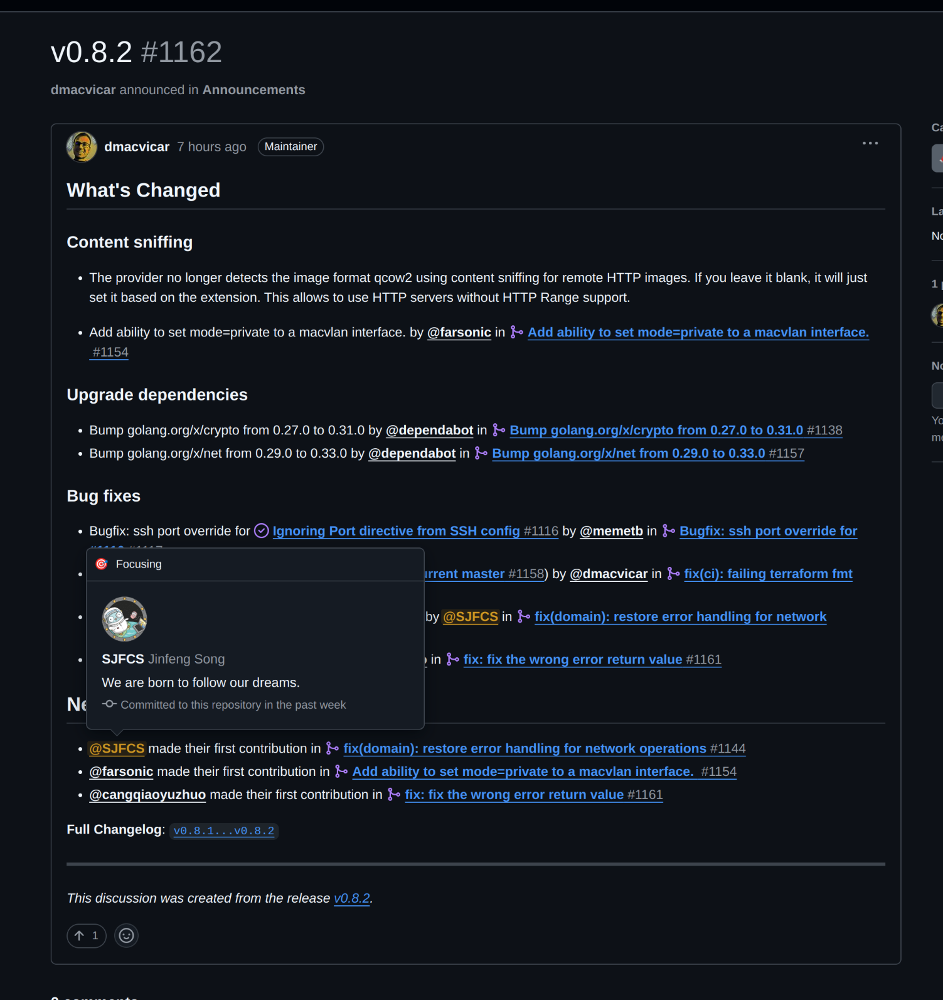

我本地使用 terraform 管理我的 kvm libvirt 。

当使用 qemu-guest-agent 获取 ip 时遇到了问题，本文记录排查和代码修复过程。

<!-- truncate -->

- 我提的 issue：https://github.com/dmacvicar/terraform-provider-libvirt/issues/1091#event-16519515888
- 我提的 pull request 已经合并：https://github.com/dmacvicar/terraform-provider-libvirt/pull/1144
- 在 release v0.8.2 中已经发布：https://github.com/dmacvicar/terraform-provider-libvirt/discussions/1162



## debug

经过分析，了关键的区别如下：

1.  在 0.7.1 版本中，`domainGetIfacesInfo`  函数对错误处理有特殊的逻辑：

```go

switch virErr := err.(type) {
case libvirt.Error:
    // Agent can be unresponsive if being installed/setup
    if addrsrc == uint32(libvirt.DomainInterfaceAddressesSrcLease) && virErr.Code != uint32(libvirt.ErrOperationInvalid) ||
        addrsrc == uint32(libvirt.DomainInterfaceAddressesSrcAgent) && virErr.Code != uint32(libvirt.ErrAgentUnresponsive) {
        return interfaces, fmt.Errorf("Error retrieving interface addresses: %w", err)
    }
}
```

2.  而在最新版本中，错误处理变得更简单：

```go

if err != nil {
    return interfaces, fmt.Errorf("error retrieving interface addresses: %w", err)
}
```

这就是导致问题的关键：

1.  在 0.7.1 版本中，如果使用 qemu-agent 获取 IP 地址时遇到  `ErrAgentUnresponsive`  错误，代码会忽略这个错误并继续尝试，这给了 qemu-agent 启动和响应的时间。

2.  在新版本中，任何错误都会直接返回，包括  `ErrAgentUnresponsive`，这导致在 qemu-agent 还没有完全启动和响应时就失败了。

解决方案有 2 个：

1. 修改 provider 代码，恢复 0.7.1 版本的错误处理逻辑，提交 PR 到上游。修改内容大致如下：

```go
func domainGetIfacesInfo(virConn *libvirt.Libvirt, domain libvirt.Domain, rd *schema.ResourceData) ([]libvirt.DomainInterface, error) {
    //...省略
    // 这里开始修改
	// get all the interfaces attached to libvirt networks
	var interfaces []libvirt.DomainInterface
	interfaces, err = virConn.DomainInterfaceAddresses(domain, addrsrc, 0)
	if err != nil {
		switch virErr := err.(type) {
		case libvirt.Error:
			// Agent can be unresponsive if being installed/setup
			if addrsrc == uint32(libvirt.DomainInterfaceAddressesSrcLease) && virErr.Code != uint32(libvirt.ErrOperationInvalid) ||
				addrsrc == uint32(libvirt.DomainInterfaceAddressesSrcAgent) && virErr.Code != uint32(libvirt.ErrAgentUnresponsive) {
				return interfaces, fmt.Errorf("error retrieving interface addresses: %w", err)
			}
			// 如果是 ErrAgentUnresponsive，继续尝试
			return interfaces, nil
		default:
			return interfaces, fmt.Errorf("error retrieving interface addresses: %w", virErr)
		}
	}
	return interfaces, nil
}
```

## terraform 本地插件

由于上游合并需要时间，在此间我是用本地插件机制来使用我编译后的插件，如下放入指定位置然后引用既可。

````terraform
  required_providers {
    libvirt = {
      source  = "local/providers/libvirt"
      version = "1.0.0"
    }
```

```bash
~/.terraform.d/plugins/local/providers/libvirt/1.0.0/linux_amd64/

~/.terraform.d/plugins/
└── local
    └── providers
        └── libvirt
            └── 1.0.0
                └── linux_amd64
                    └── terraform-provider-libvirt
````

当然我尝试过 pulumi ，结果发现 pulumi 是对 tf 进行了一层包装本质还是使用的 terraform libvirt 插件，所以有同样的问题。
