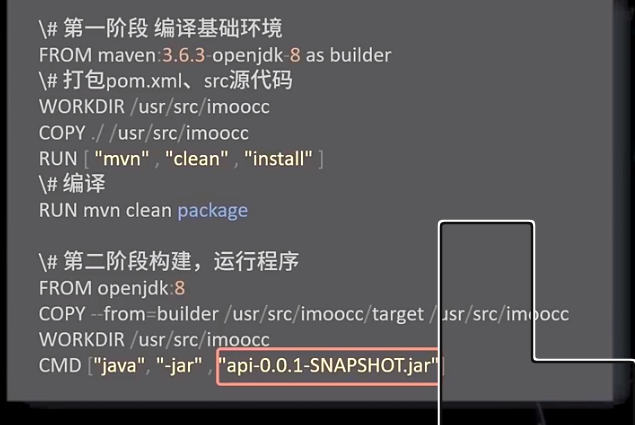

镜像优化
- 体积优化
  - 指令合并都可以优化体积嘛
  - .dockerignore sd
  - 多阶段 sd
  - 构建缓存
    - 本地缓存
    - 分层缓存（父层没有变化，cun copy add 新层，构建指令不便，文件校验和一致）

buildkit？？多阶段并发构建
  - 合理层数
  - 清理中间产物
  - 选择合适的基础镜像
  - 优化网络需求 sd 
- 时间优化
  - 流水线牺牲销量空间换取时间
  - 网络优化
    - 调整构建机器网络质量
    - 配置镜像仓库加速
- alipine 有何风险，适用所有场景嘛
  - 依赖库  go -- cgo
  - muslibc dns解析 glibc resove部分不支持
  - bash脚本
  - 时区
  - lxcfs容器资源可见性
  - 
- 新的镜像格式 阿里dadi镜像p2p网络
- 安全问题

spring java 优化

naveimage

安全扫描，权限控制等

最小容器 攻击面

如何制作最小容器

各种打包工具

golang glibec 打包问题

LXCFS来解决容器内获取CPU/内存不准的问题