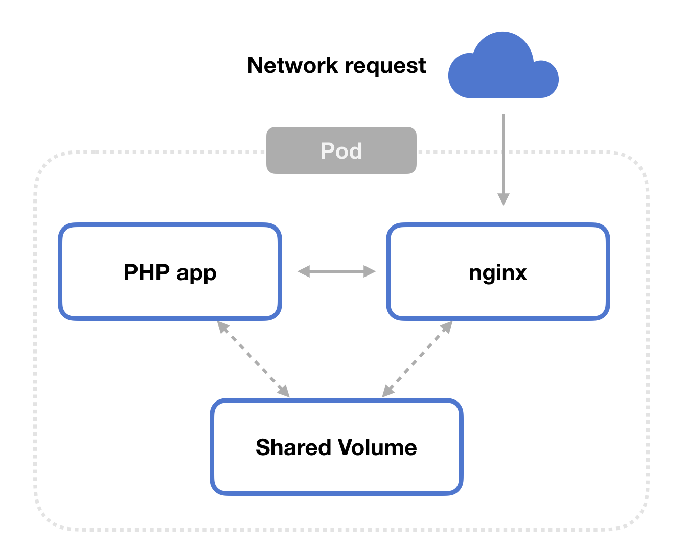

# php 上云迁移例子


## Step 1: the PHP app

Create your PHP application. In this article, we’ll use a simple hello world example. Create this file and call it hello.php.
```php
<html>
    <head>
        <title>PHP Hello World!</title>
    </head>
    <body>
        <?php echo '<h1>Hello World</h1>'; ?>
        <?php phpinfo(); ?>
    </body>
</html>
```

## Step 2: the Dockerfile

Now create a Dockerfile based off the FPM variant of PHP, which is php:7.2-fpm for us. Copy your PHP source code into a directory in that Docker image.
```dockerfile
# docker build . -t my-php-app:1.0.0

FROM php:7.2-fpm
RUN mkdir /app
COPY hello.php /app
```
## Step 3: the ConfigMap

Let’s get into Kubernetes-land.

We’re going to have two containers running in the pod. One runs PHP-FPM to handle dynamic PHP processing, and the other runs nginx to act as a web server. Both containers read from a shared volume.

We need to set up our configuration settings for the nginx container we’ll create.

Here, we tell nginx to send any request for a *.php file to our PHP-FPM application via localhost:9000.
```yaml
# First, create a ConfigMap whose contents are used
# as the nginx.conf file in the web server. 
# This server uses /var/www/html as its
# root document directory. When the server gets a 
# request for *.php, it will forward that request
# to our PHP-FPM container.

kind: ConfigMap
apiVersion: v1
metadata:
  name: nginx-config
data:
  nginx.conf: |
    events {
    }
    http {
      server {
        listen 80 default_server;
        listen [::]:80 default_server;
        
        # Set nginx to serve files from the shared volume!
        root /var/www/html;
        server_name _;
        location / {
          try_files $uri $uri/ =404;
        }
        location ~ \.php$ {
          include fastcgi_params;
          fastcgi_param REQUEST_METHOD $request_method;
          fastcgi_param SCRIPT_FILENAME $document_root$fastcgi_script_name;
          fastcgi_pass 127.0.0.1:9000;
        }
      }
    }
view rawconfigmap.yaml hosted with ❤ by GitHub
Step 4: the Pod
Finally, we can create the Kubernetes pod that runs our application container and the nginx web server sidecar.

Be sure to read through the comments in the gist.

# Create a pod containing the PHP-FPM application (my-php-app)
# and nginx, each mounting the `shared-files` volume to their
# respective /var/www/html directories.

kind: Pod
apiVersion: v1
metadata:
  name: phpfpm-nginx-example
spec:
  volumes:
    # Create the shared files volume to be used in both pods
    - name: shared-files
      emptyDir: {}
    
    # Add the ConfigMap we declared above as a volume for the pod
    - name: nginx-config-volume
      configMap:
        name: nginx-config

  containers:
    # Our PHP-FPM application
    - image: my-php-app:1.0.0
      name: app
      volumeMounts:
        - name: shared-files
          mountPath: /var/www/html
      # Important! After this container has started, the PHP files
      # in our Docker image aren't in the shared volume. We need to 
      # get them into the shared volume. If we tried to write directly
      # to this volume from our Docker image the files wouldn't appear
      # in the nginx container.
      #
      # So, after the container has started, copy the PHP files from this
      # container's local filesystem (/app -- added via the Docker image) 
      # to the shared volume, which is mounted at /var/www/html.
      lifecycle:
        postStart:
          exec:
            command: ["/bin/sh", "-c", "cp -r /app/. /var/www/html"]
    
    # Our nginx container, which uses the configuration declared above,
    # along with the files shared with the PHP-FPM app.
    - image: nginx:1.7.9
      name: nginx
      volumeMounts:
        - name: shared-files
          mountPath: /var/www/html
        - name: nginx-config-volume
          mountPath: /etc/nginx/nginx.conf
          subPath: nginx.conf
```

## 参考文档
https://matthewpalmer.net/kubernetes-app-developer/articles/php-fpm-nginx-kubernetes.html
