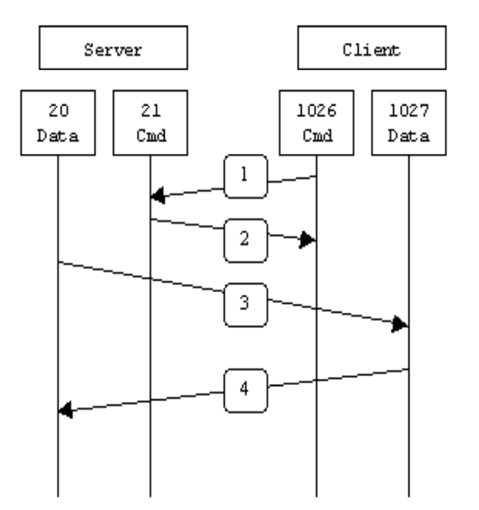
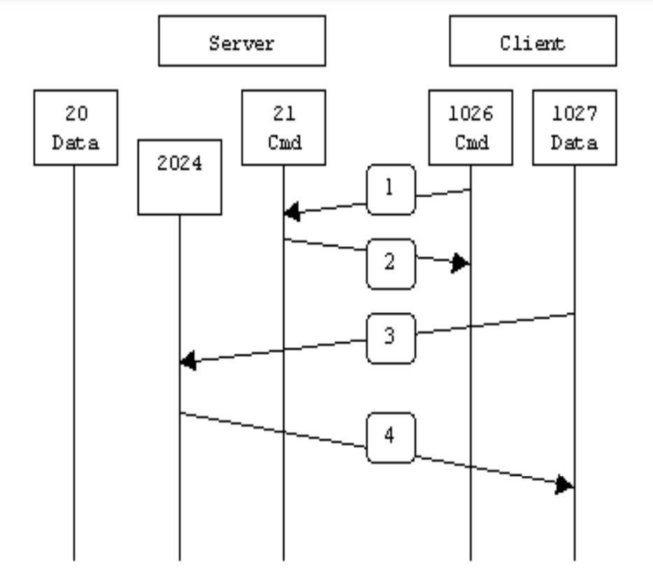

FTP 是仅基于 TCP 的应用层协议，不支持 UDP 。 FTP 使用两个端口：20（数据端口）和 21（命令端口）。

但FTP有两种不同的模式——主动模式(Active)及被动模式(Passive)，被动模式时数据端口并不总是20。这就是主动与被动FTP的最大不同之处。

:::tip
FTP 最早是明文传输的，有很大的安全隐患，因此出现了两种加密方式：

一种是 SFTP，是使用 ssh 作为通道传输文件，因为 ssh 是全程加密的，所以，以 ssh 作为通道传输 FTP 也就是安全的。这种方式优点是不再占用20、21 端口，只使用 22 端口就可以完成全部任务，缺点是传送速度慢，尤其是大量小文件的速度极慢

一种是 FTPS，是 FTP 协议使用 ssl 加密的版本，这种方式，使用的端口和 FTP 一样，只是建立连接后使用 ssl 加密传输文件，优点是可以独立控制用户密码，有各种高级功能，速度也很快。
:::
## PORT 主动模式
在主动模式下，client端会随机选择一个端口（通常>1024）跟server端的命令端口（21）连线并告诉server自己会用哪一个端口来传输数据（通常是N +1），连接着服务器可以利用自己的数据端口(20)来跟客户端指定的传输端口连线。



在FTP主动模式下，数据连接由服务端发起建立请求，而客户端则被动接受连接请求。

## PASV 被动模式 

在被动模式下，client端会先开两个没被使用的端口N(N>1024与N+1)，第一个端口跟server端的命令端口(21)连线，与主动模式不同的是：

- 在主动模式下，客户端会告诉服务器说：“嗨！我用端口N当前数据端口哦“
- 在被动模式下写告诉服务器：“嗨！我是用被动模式哦”
  
然后server可以随机选择一个固定使用的端口P(P > 1024)回给client端，最后client可以使用数据端口(N+1)跟server的端口P连线来传输数据。



在FTP被动模式下，数据连接由客户端发起建立请求，而服务端则被动接受连接请求。


## FTP 上传模式

FTP上传方式有两种：ASCII（文本模式）和BINARY（二进制模式）。

- ASCII上传模式  
  在 ASCII 上传模式下，文件被传输为文本文件，按行结束符分割。对于Linux操作系统，它的行结束符是“\n”（换行符），而对于Windows操作系统，行结束符是“\r\n”，因此上传到Windows系统中的文本文件，需要将“\n”转换为“\r\n”。如果上传的文件不是文本文件，而是二进制文件，则应选择 BINARY 模式。

- BINARY上传模式  
  在 BINARY 上传模式下，以字节为单位传输文件，无转换或处理，能保持文件的完整性和准确性。BINARY 上传模式通常用于上传二进制文件，如声音、影像、可执行文件、压缩包等。

## 使用案例
ftp-service 192.168.1.10 的工作模式默认为主动模式  
ftp-client 的工作模式为被动模式  
直接连接会导致报错，下面在 ftp-client 连接 ftp-service 进行演示
```bash
root@ftp-client:root# ftp # 输入 ftp 命令
ftp> open 192.168.1.10 # <FTP Server IP> 与 FTP 服务器建立连接
Connected to 192.168.1.10.
220 (vsFTPd 2.2.2)
Name (192.168.1.10:root): user # 输入帐号
331 Pleasespecify the password.
Password: # 输入密码
230 Login successful.
Remotesystemtypeis UNIX.
Using binarymodeto transfer files.
ftp> ls # 默认情况下输入ls命令会报错，如下
500 IllegalPORT command.
ftp: bind:Addressalready in use
ftp> passive # 需要把模式改为被动模式
Passive mode on.
ftp> ls
227 Entering Passive Mode(192.168.1.10,35,55).
150 Herecomes the directory listing.
226 Directory send OK.
ftp> hash
Hashmark printing on (1024 bytes/hashmark).
ftp> bin
200 Switching to Binarymode.
# 配置完之后可以看到终端中文件在上传
put file-1 #使用put将file-1文件上传到ftp-service上。可以看到进度条一直在走，等待即可，
```


## 参考
- https://www.cosmos.esa.int/documents/772136/977578/psa_activeVsPassiveFtp.pdf/5e36a7b8-8732-4e65-ab6b-6cf94a742ea6
- https://medium.com/@penril0326/%E7%B0%A1%E5%96%AE%E4%BB%8B%E7%B4%B9ftp-67bd4df922b2