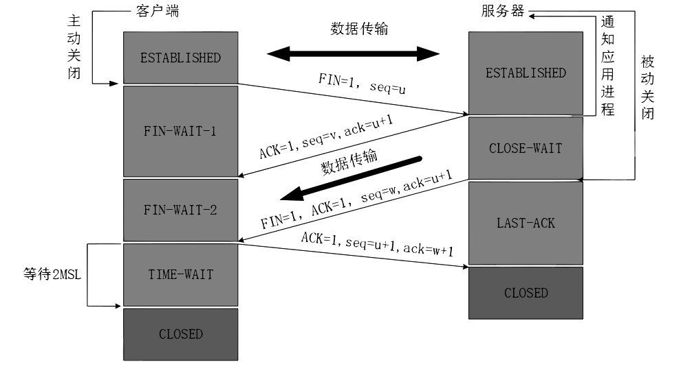

https://web.archive.org/web/20220401051111/http://ccietea.com/

https://mp.weixin.qq.com/s/25atTs4b-vORIx525ur_aw

https://www.zhihu.com/question/21546408/answer/2120115071

https://mp.weixin.qq.com/s/jiPMUk6zUdOY6eKxAjNDbQ

https://cyclinder.gitbook.io/cloud-native-network/

https://github.com/DaoCloud-OpenSource/network

https://www.zsythink.net/archives/4409

https://zjj2wry.github.io/network/iptables/

https://www.cnblogs.com/chenxiaomeng/p/10512798.html 

https://www.zhihu.com/question/22677800/answer/2620870702?utm_id=0
https://blog.csdn.net/ITlanyue/article/details/104416850

https://blog.csdn.net/qq_44443986/article/details/115966274?utm_source=app&app_version=4.7.1&code=app_1562916241&uLinkId=usr1mkqgl919blen

https://blog.csdn.net/qq_43255017/article/details/104483015

https://mp.weixin.qq.com/s?__biz=Mzg2OTg3MTU2OQ==&mid=2247505821&idx=1&sn=8e701fab98b3ec849845770d997de649&source=41#wechat_redirect

https://www.cnblogs.com/sxiszero/p/11565108.html

https://www.freebuf.com/column/194861.html

https://leon-wtf.github.io/

https://ieevee.com/tech/2017/09/18/k8s-svc-src.html

https://web.archive.org/web/20230322045749/https://www.asykim.com/blog/deep-dive-into-kubernetes-external-traffic-policies

https://web.archive.org/web/20230322163903/https://www.asykim.com/blog/kubernetes-traffic-engineering-with-bgp

- [《图解TCP/IP》](https://leon-wtf.github.io/doc/%E5%9B%BE%E8%A7%A3TCPIP.pdf)
-《TCP/IP 详解卷1：第2版》
-《计算机网络》 谢希仁

[wireshark tcp的三次握手和四次挥手 ACK SYN 第四次挥手后的等待2msl的原因](https://zhuanlan.zhihu.com/p/37641172)

time-wait开始的时间为tcp四次挥手中主动关闭连接方发送完最后一次挥手，也就是ACK=1的信号结束后，主动关闭连接方所处的状态。

然后time-wait的的持续时间为2MSL. MSL是Maximum Segment Lifetime,译为“报文最大生存时间”，可为30s，1min或2min。2msl就是2倍的这个时间。工程上为2min，2msl就是4min。但一般根据实际的网络情况进行确定。

然后，为什么要持续这么长的时间呢？

原因1：为了保证客户端发送的最后一个ack报文段能够到达服务器。因为这最后一个ack确认包可能会丢失，然后服务器就会超时重传第三次挥手的fin信息报，然后客户端再重传一次第四次挥手的ack报文。如果没有这2msl，客户端发送完最后一个ack数据报后直接关闭连接，那么就接收不到服务器超时重传的fin信息报(此处应该是客户端收到一个非法的报文段，而返回一个RST的数据报，表明拒绝此次通信，然后双方就产生异常，而不是收不到。)，那么服务器就不能按正常步骤进入close状态。那么就会耗费服务器的资源。当网络中存在大量的timewait状态，那么服务器的压力可想而知。

原因2：在第四次挥手后，经过2msl的时间足以让本次连接产生的所有报文段都从网络中消失，这样下一次新的连接中就肯定不会出现旧连接的报文段了。也就是防止我们上一篇文章 为什么tcp是三次握手而不是两次握手？ 中说的：已经失效的连接请求报文段出现在本次连接中。如果没有的话就可能这样：这次连接一挥手完马上就结束了，没有timewait。这次连接中有个迷失在网络中的syn包，然后下次连接又马上开始，下个连接发送syn包，迷失的syn包忽然又到达了对面，所以对面可能同时收到或者不同时间收到请求连接的syn包，然后就出现问题了。

