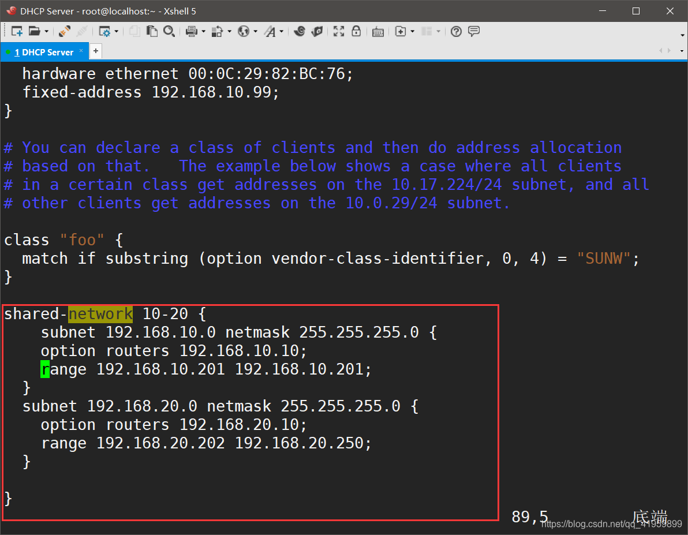
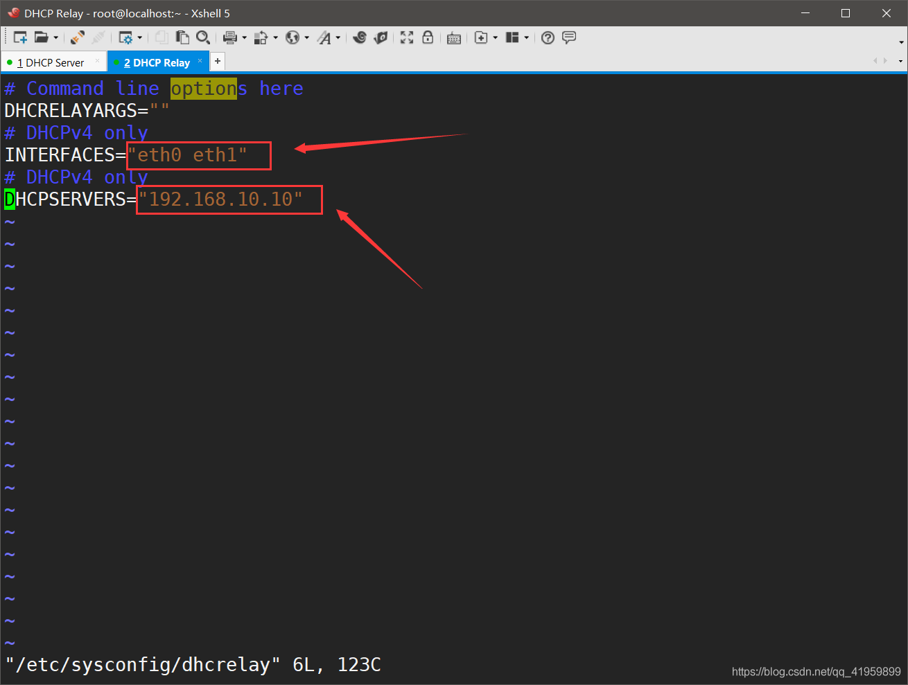

II. 单作用域

什么是单作用域

如何配置单作用域

单作用域的优缺点


III. 超级作用域

什么是超级作用域

如何配置超级作用域

超级作用域的优缺点


IV. DHCP中继

什么是DHCP中继

如何配置DHCP中继

DHCP中继的优缺点


V. 其他场景

多作用域

动态DNS

PXE引导

静态IP地址分配


```
linux两块网卡俩dhcp 怎么指定
可以使用dhclient命令手动指定网络接口和DHCP服务器。


例如，如果您的第一块网卡是eth0，第二块网卡是eth1，您可以使用以下命令来指定eth0从DHCP服务器获取IP地址：


sudo dhclient eth0

同样，您可以使用以下命令来指定eth1从DHCP服务器获取IP地址：


sudo dhclient eth1

请注意，使用此命令将覆盖任何先前手动配置的网络设置。如果您想在系统启动时自动获取IP地址，请确保在/etc/network/interfaces文件中正确配置每个接口的DHCP设置。
```
## 配置案例
### 基本
https://blog.csdn.net/qq_41959899/article/details/108969660  
- 手动分配：特定的 IP 地址由管理员预先分配给单个设备。DHCP 仅将 IP 地址传送给设备。
- 自动分配： DHCP 自动为设备永久分配一个 IP 地址，从可用地址池中选择它。
- 动态分配： DHCP 在服务器选择的有限时间内从地址池中分配一个 IP 地址，或者直到客户端告诉 DHCP 服务器它不再需要该地址。
http://www.tcpipguide.com/free/t_DHCPAddressAssignmentandAllocationMechanisms.htm


编辑ISC DHCP服务器的配置文件/etc/dhcp/dhcpd.conf，添加以下内容：

```bash

要配置DHCP服务器以指定NTP服务器，请按照以下步骤操作：
打开DHCP服务器的配置文件，通常在/etc/dhcp/dhcpd.conf。
找到要为其配置NTP服务器的子网段的定义，例如：

subnet 192.168.1.0 netmask 255.255.255.0 {
  range 192.168.1.10 192.168.1.50;
  option routers 192.168.1.1;
}

在子网段定义中添加以下行以指定NTP服务器：

option ntp-servers 192.168.1.100;

其中192.168.1.100是您要使用的NTP服务器的IP地址。如果您有多个NTP服务器，请将它们用逗号分隔。

在子网段定义中添加以下行以指定DNS服务器：

option domain-name-servers 8.8.8.8,8.8.4.4;


## 指定固定IP
以下是一个简单的DHCP服务器配置文件，其中包括一个固定IP地址分配的示例：

# /etc/dhcp/dhcpd.conf

# 设置DHCP服务器的名称和域名
option domain-name example.com;
option domain-name-servers 8.8.8.8;

# 定义DHCP地址池
subnet 192.168.1.0 netmask 255.255.255.0 {
  range 192.168.1.10 192.168.1.100;
  option routers 192.168.1.1;
  option broadcast-address 192.168.1.255;
}

# 配置固定IP地址
host my-computer {
  hardware ethernet 00:11:22:33:44:55;
  fixed-address 192.168.1.5;
}

# 其他配置选项
default-lease-time 600;
max-lease-time 7200;

在上面的示例中，我们为一个名为"my-computer"的设备分配了固定IP地址192.168.1.5。要将此配置文件加载到DHCP服务器中，请使用以下命令：


sudo service dhcpd restart

请注意，实际的配置文件可能因系统和网络环境的不同而有所不同。
##
```

这里配置了一个子网为192.168.1.0/24的DHCP服务器，分配的IP地址范围是192.168.1.10 - 192.168.1.50，默认网关是192.168.1.1，DNS服务器是Google的公共DNS。

其中，option routers指定了网关地址，option domain-name-servers指定了DNS服务器地址。

### 配置网络接口：
编辑网络接口的配置文件/etc/network/interfaces，将DHCP服务器的IP地址绑定到网络接口上：
```
auto eth0
iface eth0 inet static
address 192.168.1.1
netmask 255.255.255.0
broadcast 192.168.1.255
```

以上配置表示网络接口eth0使用静态IP地址192.168.1.1，并设置子网掩码为255.255.255.0，广播地址为192.168.1.255。


### 单作用域、超级作用域和dhcp中继
【进阶—超级作用域】

目的：为不同段的网络做DHCP功能,使用一块网卡为不同网络进行路由和dhcp分配ip

Centos 6.8三台 分别为DHCP Server(route)、Client1、Client2

**实验步骤**

```
1、关闭防火墙、Senlinux、虚拟机的网卡这几步跟第一个实验相同

2、在DHCP服务器上开启子网卡；复制网卡的配置文件即可
在子网卡的配置文件中，不需要删除MAC、UID，因为这是一个子网卡，只需修改一下IP即可
```

开启DHCP服务器的路由转发功能并使其生效
```
[root@localhost ~]# sysctl -p
net.ipv4.ip_forward = 1
net.ipv4.conf.default.rp_filter = 1
net.ipv4.conf.default.accept_source_route = 0
kernel.sysrq = 0
kernel.core_uses_pid = 1
net.ipv4.tcp_syncookies = 1
kernel.msgmnb = 65536
kernel.msgmax = 65536
kernel.shmmax = 68719476736
kernel.shmall = 4294967296
```
3、修改dhcp主配置文件


### 多域案例
【高级—DHCP中继】
DHCP中继被称为DHCP Relay；是为了实现不同子网和物理网段之间处理和转发dhcp信息
DHCP Relay是一个网络协议，它可以将 DHCP 请求从一个网络中转到另一个网络上的 DHCP 服务器。在 Linux 上，可以使用 dhcrelay 命令来配置 DHCP Relay。

Centos 6.8四台 分别为DHCP Server、DHCP中继、Client1、Client2 

server      192.168.10.0/24
client1     192.168.10.0/24
client2     192.168.20.0/24
Relay&Route 且为网关

安装 dhcp-relay 软件包。在 Ubuntu 上，可以使用以下命令安装它：

```bash
sudo apt-get install dhcp-relay
```

安装 dhcp-relay 软件包。在 CentOS 上，可以使用以下命令安装：

```
sudo yum install dhcp-relay

```


配置DHCP


4、配置DHCP中继服务器
编辑 /etc/default/dhcp-relay 文件，并指定 DHCP 服务器的 IP 地址和需要中转的网络接口。例如，如果 DHCP 服务器的 IP 地址是 192.168.1.1，需要中转的网络接口是 eth0，则可以将以下行添加到 /etc/default/dhcp-relay 文件中：

```bash
DHCPD_SERVERS=192.168.1.1
INTERFACES=eth0
```
如果要中继多个 DHCP 服务器，可以使用逗号分隔它们的 IP 地址。


3.编辑 /etc/dhcp/dhcrelay.conf 文件，并指定需要中转的 DHCP 子网。例如，如果需要中转的 DHCP 子网是 192.168.2.0/24，则可以将以下行添加到 /etc/dhcp/dhcrelay.conf 文件中：

```bash
relay 192.168.2.0/24
```
```
配置网卡
eth0:192.168.10.20
eth1:100.100.100.20

vim /etc/sysconfig/dhcrelay
将自己的两个网卡接口与DHCP服务器的IP地址标明
```

```bash
# 开启路由转发并使其生效
[root@localhost ~]# vim /etc/sysctl.conf 
[root@localhost ~]# sysctl -p
net.ipv4.ip_forward = 1
# 开启中继服务
sudo service isc-dhcp-relay start
sudo systemctl enable --now dhcp-relay  
```

完成上述步骤后，DHCP 请求将被转发到指定的 DHCP 服务器上。您可以使用 tcpdump 命令来检查是否已正确配置 DHCP Relay。

