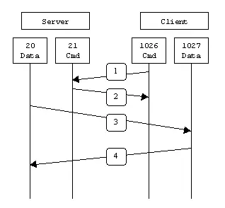

http://cn.linux.vbird.org/linux_server/linux_redhat9/0410vsftpd.php

## FTP上传bin模式与ASCII模式


## 主动模式与被动模式 PORT 主动   PASV被动


FTP 是仅基于 TCP 的应用层协议，不支持 UDP 。 FTP 使用两个端口，一个数据端口和一个命令端口（也称为控制端口）。通常情况下，端口 21（命令端口），端口 20（数据端口）。 但FTP工作方式的不同，数据端口并不总是20。这就是主动与被动FTP的最大不同之处。

### 主动模式

PORT主动模式 服务器S使用20(数据) 21(连接)端口  客户端C使用 客户端从一个随机的非系统端口 (N > 1023) 连接到 FTP 服务器的命令端口端口 21

C:1026 ——S:21 客户端向服务器发起连接(对于S来说 IN 21 TCP )
S:21——C:1026 服务端通过21端口给服务端一个响应
S:20——C:1025 服务端通知客户端 我将20端口用作FTP数据传输
C:1025——S:20 客户端向服务器发起数据连接请求（对S来说IN 20 TCP）

特点：
1. 服务端端口只需要开放TCP 20 21即可 
2. 经测试 C处于NAT设备后时无法与S建立数据连接 只能与S的21端口建立连接  此时FTP不能传输文件
3. 但经实际测试 C的两个端口不连续  即并不存在N和N+1端口情况


在主动模式的 FTP 中，客户端从一个随机的非系统端口 (N > 1023) 连接到 FTP 服务器的命令端口端口 21 。然后，客户端开始监听端口 N+1，并将 FTP 命令端口 N+1 告诉 FTP 服务器，“请把数据发送给我的 N+1 端口”。然后，服务器将从本地数据端口 (端口20) 连接回客户端的数据端口，也就是 N+1 端口。

因为服务器防火墙的隔离作用，我们应该确保服务器 FTP 到客户端的一下几个通道的畅通:

FTP 服务器端口 21 （接受全部客户端）

FTP 服务器端口 21 到 > 1023 的端口 ( 服务器响应客户端控制端口 )

FTP 服务器端口 20 到 > 1023 的端口 ( 服务器发起到客户端的数据端口的连接 )

从 > 1023的端口到 FTP 服务器端口 20 ( 客户端发送 ack 到服务器的数据端口 )

用图来表示这些通道：



第 1 步，客户端的命令端口与服务器的命令端口连接并发送命令端口 1027。然后，服务器在第 2 步时将一个 ACK 发送回客户端的命令端口。第 3 步，服务器在其本地数据端口上启动连接，连接到前面指定的客户端的数据端口。最后，客户端返回 ACK，如第 4 步所示。

主动模式的 FTP 主要问题实际上落在客户端。FTP 的客户端并不会主动连接到服务器的数据端口，而是是告诉服务器它正在监听哪个端口，然后服务器发起连接到客户端上指定的端口。但是，这样的连接有时候会被客户端的防火墙阻止。‘

### 被动模式 PASV

PASV被动模式  服务段使用21(连接) 以及一个大于1024的随机端口(假设3001数据) 客户端两个随机大于1024端口（举例1025 1026）

C:1026——S:21 客户端向服务器发起连接（对于S来说 IN 21 TCP）
S:21——C:1026 服务端通过21端口给服务端一个响应
C:1025——S:3001 客户端1025端口连接服务端指定范围内的>1024端口（对S来说IN  3001 TCP）
S:3001——C:1025 服务端通过3001端口与客户端1025端口进行数据传输

特点：
1. 服务端需要开放TCP21 和 >1024的部分端口范围 （可以手动指定范围）
2. 经测试 C处于任意位置都能够与S建立数据连接 此模式适合日常使用

存疑：

PASV模式时 S的数据端口假设被指定范围3000:3005  那么在第三步C通过1025去进行数据连接之前 应该还有一步是S通知C我开放的数据端口是多少

PASV模式的端口是每个客户机连接一个数据端口     那么在PORT模式下就只有20数据端口  怎么实现多用户连接传输的 待研究


为了解决服务器主动发起到客户端连接会被阻止的问题，另一种更完善的工作模式出现了，它就是 FTP 的被动模式，它工作的前提是客户端明确告知 FTP 服务器它使用被动模式。

在被动模式的 FTP 中，客户端启动到服务器的两个连接，解决了防火墙阻止从服务器到客户端的传入数据端口连接的问题。FTP 连接建立后，客户端在本地打开两个随机的非系统端口 N 和 N + 1(N > 1023)。第一个端口连接服务器上的 21 端口，但是客户端这次将会发出 PASV 命令，也就是不允许服务器连接回其数据端口。这样，服务器随后会打开一个随机的非系统端口 P (P > 1023)，并将 P 发送给客户端作为 PASV 命令的响应。然后客户端启动从端口 N+1 到端口 P 的连接来传输数据。

在被动模式中，要保持一下通道的畅通：

FTP服务器的 21 端口（接受所有客户端）

FTP服务器的 21端口到 > 1023 的远程端口 ( 服务器响应客户端控制端口 )

FTP服务器 > 1023 的端口（接受所有客户端发起的连接到服务器指定的随机端口）

FTP服务器 > 1023 的端口到 > 1023 的远程端口（服务器发送 ack 和数据到客户端数据端口）

被动模式用图表示：


第 1 步，客户端在命令端口上与服务器连接，并发出 PASV 命令。然后，服务器在第 2 步时使用端口 2024 进行响应，告诉客户端它正在监听的数据连接端口。第 3 步，客户端启动从其数据端口到指定服务器数据端口的数据连接。最后，服务器在第 4 步将 ACK 发送回客户端的数据端口。

服务器防火墙需要给 FTP 的被动模式开放一个端口范围允许所有客户端连接，比如 5000 - 6000。

### 使用案例
ftp-service 192.168.1.10 的工作模式默认为主动模式
ftp-client 的工作模式为被动模式  
直接连接会导致报错，下面在 ftp-client 连接 ftp-service 进行演示
```bash
root@ftp-client:root# ftp # 输入 ftp 命令
ftp> open 192.168.1.10 # <FTP Server IP> 与 FTP 服务器建立连接
Connected to 192.168.1.10.
220 (vsFTPd 2.2.2)
Name (192.168.1.10:root): user # 输入帐号
331 Pleasespecify the password.
Password: # 输入密码
230 Login successful.
Remotesystemtypeis UNIX.
Using binarymodeto transfer files.
ftp> ls # 默认情况下输入ls命令会报错，如下
500 IllegalPORT command.
ftp: bind:Addressalready in use
ftp> passive # 需要把模式改为被动模式
Passive mode on.
ftp> ls
227 Entering Passive Mode(192.168.1.10,35,55).
150 Herecomes the directory listing.
226 Directory send OK.
ftp> hash
Hashmark printing on (1024 bytes/hashmark).
ftp> bin
200 Switching to Binarymode.
# 配置完之后可以看到终端中文件在上传
put file-1 #使用put将file-1文件上传到ftp-service上。可以看到进度条一直在走，等待即可，
```