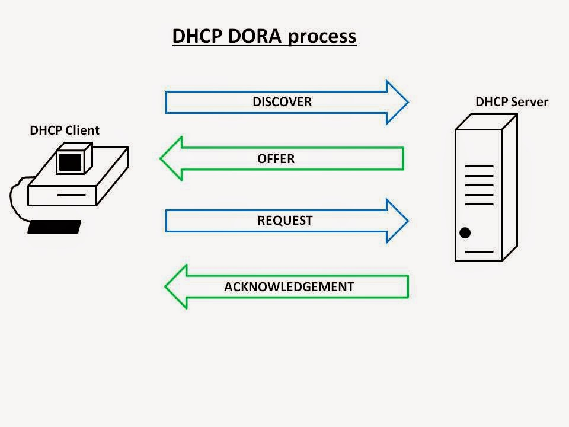

DHCP (Dynamic Host Configuration Protocol 动态主机配置协议) 和 BOOTP（Bootstrap Protocol 引导协议）是两个网络协议，用于在计算机网络中为主机用于分配 IP 地址、子网掩码、网关等网络参数

- BOOTP 是一种静态的协议，是一个早期的网络协议，主要用于在启动时分配 IP 地址。它需要手动配置客户端的 MAC 地址和 IP 地址，不支持动态分配 IP 地址，因此使用起来比较麻烦。现已被 DHCP 取代。

- DHCP 是一种动态的协议，它支持自动分配 IP 地址、支持动态 IP 地址池、IP 地址的租赁和续租、网络配置信息的更新(如 DNS NTP 地址)、支持 IPv6 等。使得网络管理员可以更轻松地管理网络。

总的来说，DHCP 是对旧协议 BOOTP 的增强，更易于管理和更适合大型网络环境，是目前应用更广泛的网络协议。

:::tip
DHCP 是应用层的协议，客户端使用 UDP 68 端口，服务端使用 UDP 67 端口。
:::

## 工作原理

DORA Process 是 DHCP 协议中的一个重要组成部分，用于向客户端提供 IP 地址及其他配置参数，它有四个主要阶段：D - Discover，O - Offer，R - Request，A - Acknowledge 。

### DHCP Discover - [广播]
  - 客户端没有任何 IP 地址，所以使用 0.0.0.0 作为源 IP 地址，发送 DHCP 广播请求（DHCPDISCOVER 报文），以查找 DHCP 服务器。
  ```yaml title="包含信息如下"
  Source IP: 0.0.0.0
  Destination IP: 255.255.255.255
  Source MAC: DHCP Client Machine MAC Address
  Destination MAC: FF:FF:FF:FF:FF:FF
  ```
### DHCP Offer - [广播]
  - 当服务器接收到 Discover 请求时，它会向客户端响应 DHCP Offer 请求，提供可用的 IP 地址和租约信息(包括子网掩码、网关地址、租用期、DNS地址、WINS服务器地址、提供响应的DHCP服务器的IP地址等)。
  ```yaml title="包含信息如下"
  Source IP: DHCP Server IP Address
  Destination IP: 255.255.255.255
  Source MAC: DHCP Server Machine MAC Address
  Destination MAC: DHCP client MAC Address
  ```
### DHCP Request - [广播]
  - 当客户端收到 Offer 应答信息后，客户端会从众多DHCP中选择一个DHCP的分配的IP地址，同时客户端还会向网络发送一个ARP(Address Resolution Protocol，地址解析协议)包，查询网络上面有没有其他机器使用该IP地址;如果发现该IP地址已经被占用，客户端则会送出一个 DHCPDISCOVER 数据包给 DHCP 务器，拒绝接受其 DHCPDISCOVER，并重新发送 DHCPDISCOVER 信息。
  - 然后客户端将以广播方式发送 Request 请求消息。(在 Request 信息中包含客户端所接受的IP地址，既通知它已选择的DHCP服务器，也通知其他DHCP服务器，以便释放它们保留的IP地址。)
  ```yaml title="包含信息如下"
  Source IP: DHCP Server IP Address
  Destination IP: 255.255.255.255
  Source MAC: DHCP Server Machine MAC Address
  Destination MAC: DHCP client MAC Address.
  ```
  :::tip
  客户端选择第一个接收到的IP。谁的IP先到客户端的速度是不可控的。但是如果在配置文件里开启了authoritative选项则表示该服务器是权威服务器，其他DHCP服务器将失效，如果多台服务器都配置了这个权威选项，则还是竞争机制
  
  通过MAC地址给客户端配置固定IP也会优先于普通的动态DHCP分配。
  :::

### DHCP Acknowledge - [广播]
  DHCP服务器接受到 Request 信息后，将已保留的IP地址标识为已租用，并以广播方式发送一个DHCP应答信息(DHCPACK)给DHCP客户端，该信息包含IP地址的有效租约以及其他配置信息。
  ```yaml title="包含信息如下"
  Source IP: DHCP Server IP Address
  Destination IP: 255.255.255.255
  Source MAC: DHCP Server Machine MAC Address
  Destination MAC: DHCP client MAC Address
  ```

**当客户端处于以下四种状态之一时，会触发 DORA Process：**

- 初始状态：当客户端首次启动或重新启动时，它处于初始状态。
- 重新请求租约状态：当客户端的IP租约过期或在一定时间内未能成功续租时，客户端会发送DHCP请求消息以请求新的IP租约。此时客户端处于重新请求租约状态。
- 释放状态：当客户端不再需要IP地址时，它可以向服务器发送DHCP释放消息，以释放已经分配的IP地址。此时客户端处于释放状态。
  例如在Windows中，为了释放和更新DHCP分配的IP，我们使用命令：
  ```cmd
  ipconfig /release
  ipconfig /renew
  ```
  在 linux 中使用
  ```bash
  sudo dhclient -r
  sudo dhclient -r eth0
  # -r表示release(释放)
  sudo dhclient
  sudo dhclient eth0
  ```
- 拒绝状态：当服务器向客户端分配的IP地址与客户端所处的网络不兼容时，客户端会拒绝接受分配的IP地址。此时客户端处于拒绝状态。


:::tip
如果DHCP 客户端和服务器位于不同的逻辑网段（如多个vlan或不同子网），则可以使用 DHCP Relay 中继代理充当转发器，在不同网段之间通过路由将 DHCP 广播包的内容通过单播的方式转发给 DHCP 服务器。

即 DHCP Relay 中继在收到 dhcp 广播后，会广播改为单播，单播封装的源ip就是其收到这个广播的接口地址，dhcp服务器根据这个接口地址选择dhcp池
:::

### DHCP 续租 ：- [单播]

这些请求从 DHCP 客户端直接发送到 DHCP 服务器，以在 IP 地址租用时间的 50% 后更新 IP 地址分配。

T1 时刻是租期到一半的时候，T2 时刻是租期到 87.5% 的时候。在 T1 时刻 客户端会单播一个 DHCP Request 报文给服务端 ，请求续租 IP 地址。如果客户端收到了 DHCP Ack 回应报文，则说明续租成功。

如果直到 T2 时刻，客户端都未收到 DHCP Ack 回应报文，那么会广播发送一个 DHCP Request 报文，继续请求续租 IP 地址。如果客户端收到了 DHCP Ack 回应报文，则说明续租成功。

如果直到租期到期， 客户端都未收到 DHCP Ack 回应报文，那么必须停止使用原来的 IP 地址。 客户端将从发现阶段开始，重新来申请一个 IP 地址。

:::tip
有些机器希望一直使用一个固定的IP，也就是静态IP，除了手动进行配置，DHCP服务器也可以实现这个功能。DHCP服务器可以根据MAC地址来分配这台机器固定IP地址（保留地址），即使重启或重装了系统也不会改变根据MAC地址分配的地址。
:::

## 补充
如果不让 dhcp 修改 `/etc/resolv.conf` 里的内容，就在网卡配置文件 `/etc/sysconfig/network-scripts/ifcfg-*` 里添加 `PEERDNS=no` 。

每次重启网卡默认都获取的同一个ip，有时候想换个ip都很麻烦。在 `/var/lib/dhclient/` 目录下有`.leases`文件，将它们清空或者删除这些文件中对应网卡的部分，再重启网络就可以获取新的动态ip。  或者，在 `/etc/sysconfig/network-scripts/ifcfg-eth0` 加入`DHCPRELEASE=yes`。 

当运行`ifdown eth0`的时候就会发出`dhcprelase`报文，查看`/etc/sysconfig/network-scripts/ifdown-eth`脚本中实际上是调用`dhclient`命令，用下面这个命令应该也可以。

## 参考文档
https://zhuanlan.zhihu.com/p/372608515

https://www.geeksforgeeks.org/dynamic-host-configuration-protocol-dhcp/
