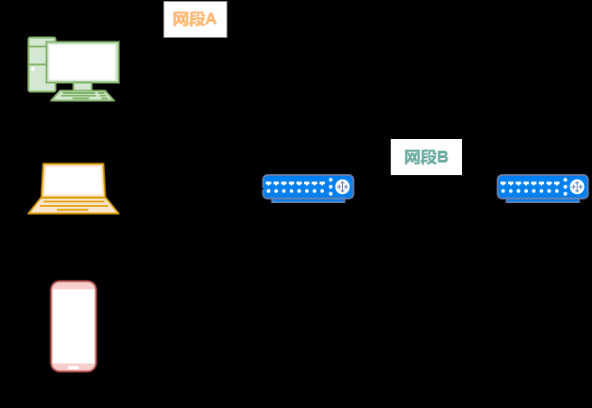
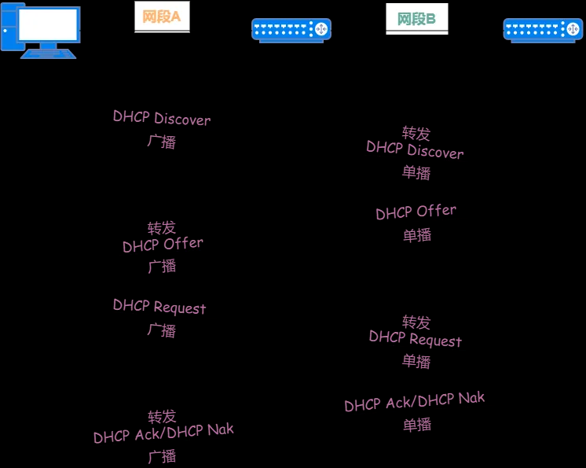
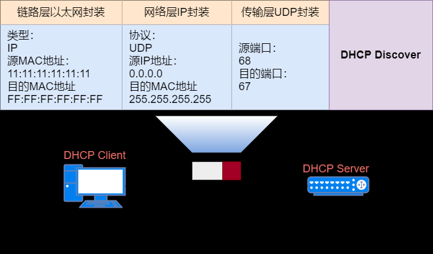
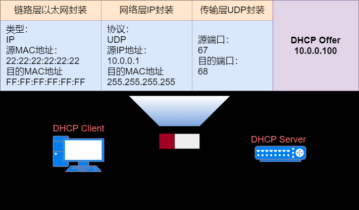
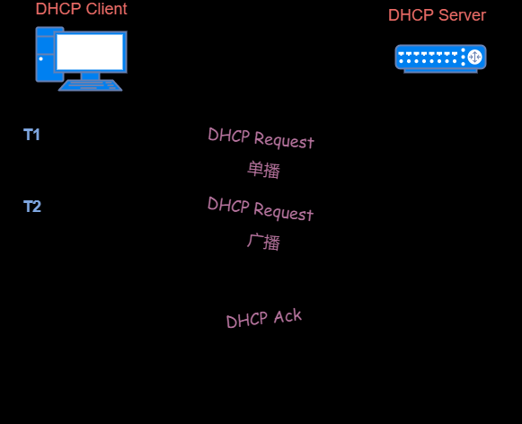
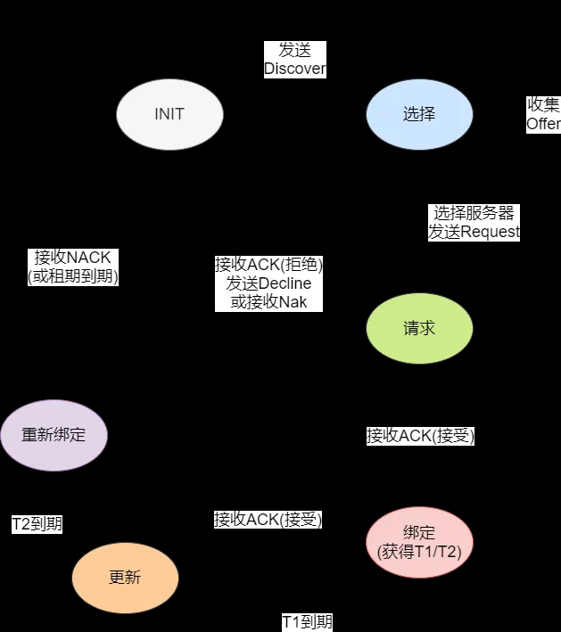

DHCP (Dynamic Host Configuration Protocol 动态主机配置协议) 和 BOOTP（Bootstrap Protocol 引导协议）是两个网络协议，用于在计算机网络中为主机用于分配 IP 地址、子网掩码、网关等网络参数

- BOOTP 是一种静态的协议，是一个早期的网络协议，主要用于在启动时分配 IP 地址。它需要手动配置客户端的 MAC 地址和 IP 地址，不支持动态分配 IP 地址，因此使用起来比较麻烦。现已被 DHCP 取代。

- DHCP 是一种动态的协议，它支持自动分配 IP 地址、支持动态 IP 地址池、IP 地址的租赁和续租、网络配置信息的更新(如 DNS NTP 地址)、支持 IPv6 等。使得网络管理员可以更轻松地管理网络。

总的来说，DHCP 是对旧协议 BOOTP 的增强，更易于管理和更适合大型网络环境，是目前应用更广泛的网络协议。

:::tip
DHCP 是应用层的协议，客户端使用 UDP 68 端口，服务端使用 UDP 67 端口。
:::

## 专有名词
在开始前我先了解一下相关名词。
### 作用域

作用域是网络上可用的IP地址的完整联系范围，又称为IP地址段或IP地址范围。DHCP以作用域为基本管理单位向客户端提供IP地址分配服务。是网络中可管理的IP地址分组，管理对客户端IP地址通读任何相关配置参数的分发和指派。

### 超级作用域 shared-network

超级作用域是作为单一实体来管理的作用域集合，也就是说，当DHCP服务器上有多个作用域时，可以组成超级作用域。超级作用域用来实现对同一个物理子网中包含多个逻辑IP子网。在超级作用域中只包含可同时激活的成员作用域或自作用域的列表。但是超级作用域并不同于设置具体的范围。如果想配置超级作用域内使用的多数属性，用户需要单独配置成员作用域或子作用域属性。

:::tip
DHCP作用域和超级作用域都是指在DHCP服务器上设置的IP地址范围，但是它们之间有一些不同点。

范围：DHCP作用域是指在DHCP服务器上设置的IP地址范围，可以包含多个IP地址。超级作用域则是指在DHCP服务器上设置的多个DHCP作用域的集合。

分配方式：DHCP作用域中的IP地址是按照一定规则进行分配的，如先到先得或者按照MAC地址进行分配。而超级作用域中的IP地址则可以在多个DHCP作用域之间进行分配，以保证整个网络中的IP地址都能够充分利用。

管理：DHCP作用域可以单独进行管理，包括IP地址的分配、续租、释放等操作。而超级作用域则需要在多个DHCP作用域之间进行协调和管理，以确保整个网络的IP地址分配能够协调一致。

总的来说，DHCP作用域和超级作用域都是为了管理和分配IP地址而设立的，只是超级作用域更加灵活和综合，适合于大规模网络的IP地址管理。
:::
### 排除范围与地址池

排除范围是作用域内从DHCP服务中排除的有限IP地址序列。被排除的IP地址，服务器不会提供给网络上的DHCP客户端。

地址池是DHCP作用域中可用的IP地址的集合，也就是使用排除范围后剩余的IP地址。DHCP服务器可将池内地址动态指派给网络上的DHCP客户端。

例如，在创建作用域时，如果设置的地址范围是192.168.1.1～192.168.1.254，同时设置了排除范围为192.168.1.50～192.168.1.100，那么该DHCP服务器不会将192.168.1.50～192.168.1.100范围内的IP地址提供给客户端，而地址池就是192.168.1.1～192.168.1.49和192.168.1.101～192.168.1.254。

:::tip
DHCP排除范围和地址池都是DHCP服务器上设置IP地址范围的方式，但是它们的作用和使用方法有所不同。


DHCP排除范围


DHCP排除范围是指在DHCP服务器上设置的一些IP地址，这些地址不会被DHCP服务器分配给客户端设备使用。通常情况下，这些IP地址是已经被其他设备使用或者需要保留的地址，例如网关、DNS服务器等。DHCP服务器在分配IP地址给客户端时，会先检查DHCP排除范围，确保所分配的IP地址不在排除范围内。

举个例子，假设DHCP服务器的IP地址为192.168.1.1，需要设置排除范围为192.168.1.2-192.168.1.10，那么DHCP服务器在分配IP地址给客户端时，会避免使用这个范围内的IP地址。

:::tip
 配置文件路径：/etc/dhcp/dhcpd.conf
```bash
# 定义 DHCP 服务器的名称
option domain-name &quot;example.com&quot;;
option domain-name-servers dns-server.example.com;

# 定义 DHCP 服务器监听的网卡
subnet 192.168.1.0 netmask 255.255.255.0 {
  range 192.168.1.100 192.168.1.200; # 定义地址池
  option routers 192.168.1.1; # 定义网关
  option broadcast-address 192.168.1.255; # 定义广播地址
  default-lease-time 600; # 定义默认 IP 地址租用时间
  max-lease-time 7200; # 定义最长 IP 地址租用时间
}

# 定义 DHCP 排除范围
host server {
  hardware ethernet 00:11:22:33:44:55;
  fixed-address 192.168.1.10;
}

# 允许 DHCP 客户端请求固定的 IP 地址
host client {
  hardware ethernet 00:aa:bb:cc:dd:ee;
  fixed-address 192.168.1.50;
}
该配置文件定义了DHCP服务器的名称、监听的网卡、地址池、网关、广播地址、IP地址租用时间、DHCP排除范围和允许DHCP客户端请求固定的IP地址等。请根据实际情况进行修改和调整。

```
:::

地址池

地址池是DHCP服务器上用于分配IP地址的范围，它包含了可以分配给客户端设备使用的IP地址。DHCP服务器按照地址池内的规则，为客户端设备分配IP地址。如果地址池中的IP地址用完了，DHCP服务器将不再分配IP地址，而是等待一段时间后重新分配。

举个例子，假设DHCP服务器的IP地址为192.168.1.1，需要设置地址池为192.168.1.20-192.168.1.100，那么DHCP服务器在分配IP地址给客户端时，只会使用这个范围内的IP地址。

总的来说，DHCP排除范围和地址池都是在DHCP服务器上设置IP地址范围的方式，但是它们的作用和使用方法有所不同，需要根据具体情况进行选择。
:::
### DHCP Relay

如果有多个子网，可以使用DHCP Relay将DHCP请求转发到DHCP服务器。
动态获取 IP 地址的过程中，使用广播方式发生报文，因此 DHCP 只适用于 小 C 和 小 S 在同一个子网内的情况。如果为每个网段配置一个 小 S ，这显然太浪费了。





DHCP Relay 的工作原理如下：

小 C 发送 DHCP Discover 或 DHCP Request 广播报文，具有 DHCP Relay 功能的网络设备收到后，根据配置将报文单播给指定的 小 S ；
小 S 进行 IP 地址的分配，单播发送给 DHCP Relay ，DHCP Relay 再将配置信息广播给 小 C ，完成对 小 C 的动态配置。




### DHCP 服务器
——通常是服务器或路由器——是运行在 DHCP 服务上的联网设备。DHCP 服务器保存 IP 地址以及与配置有关的相关信息。

### DHCP 客户端
是连接到网络并与 DHCP 服务器通信的设备（例如计算机或电话）。

### IP租约
IP租约是指DHCP服务器分配给DHCP客户端的IP地址及其他配置参数的有效期限。在租约过期前，DHCP客户端需要向DHCP服务器发送续租请求，以延长租约期限。如果DHCP客户端在租约过期后仍然需要使用IP地址，则需要重新请求IP地址分配。
### IP租约进程
IP租约进程是DHCP协议中的一个重要组成部分，用于管理DHCP客户端分配的IP地址及其他配置参数的租约。IP租约进程由DHCP服务器负责，主要用于以下三个方面：

- IP地址分配：当DHCP客户端向DHCP服务器发送IP地址请求时，IP租约进程会从DHCP服务器的IP地址池中选择一个可用的IP地址，并将其分配给DHCP客户端。在分配IP地址时，IP租约进程会为每个分配的IP地址设置一个租约期限，以确保IP地址被充分利用。

- 租约维护：在DHCP客户端使用IP地址的过程中，IP租约进程会监视租约期限，并在租约即将到期时向DHCP客户端发送续租请求。如果DHCP客户端未能及时响应续租请求，则IP租约进程会将IP地址收回，并重新放回DHCP服务器的IP地址池中，以便其他DHCP客户端使用。

- 租约释放：当DHCP客户端不再需要IP地址时，它可以向DHCP服务器发送IP地址释放请求，以释放已经分配的IP地址。IP租约进程会收到释放请求，并将IP地址从DHCP客户端的租约列表中删除，并将其标记为可用状态，以便其他DHCP客户端使用。

当客户端处于以下四种状态之一时，会触发IP租约进程：

- 初始状态：当客户端首次启动或重新启动时，它处于初始状态。
- 重新请求租约状态：当客户端的IP租约过期或在一定时间内未能成功续租时，客户端会发送DHCP请求消息以请求新的IP租约。此时客户端处于重新请求租约状态。
- 释放状态：当客户端不再需要IP地址时，它可以向服务器发送DHCP释放消息，以释放已经分配的IP地址。此时客户端处于释放状态。这种情况发生于用户输入ipconfig /release和ipconfig /renew命令时。
- 拒绝状态：当服务器向客户端分配的IP地址与客户端所处的网络不兼容时，客户端会拒绝接受分配的IP地址。此时客户端处于拒绝状态。

## 工作原理

DHCP 客户端到服务器的通信由一下三种交互组成：

:::info
为了让你不在困惑。这里复习一下基本知识  二层三层 广播组播

https://zhuanlan.zhihu.com/p/337911753
:::

**1. 基于广播的 DORA**（**发现、提供、请求、确认）。此过程包括以下步骤：
(1)客户机请求IP地址（DHCPDISCOVER）

  - DHCP 客户端会使用0.0.0.0作为源IP地址，255.255.255.255作为目的的地址，发送 DHCP 广播请求（DHCPDISCOVER报文）,此时网段内所有机器都收到报文，只有DHCP服务器返回消息
  - 广播发送包括网卡的MAC地址和NetBIOS名称的DHCP发现信息。
:::info
每个网卡都有唯一的mac地址，mac位于二层
:::

(2)服务器提供IP地址（DHCPOFFER）

  - DHCP服务器(同一网络中可存在多个DHCP服务器)在收到 DHCP Offer 广播响应，提供可用的 IP 地址租约
  - 就从IP地址池中选取一个没有出租的IP地址连同其他TCP/IP网络配置(包括子网掩码、网关地址、租用期、DNS地址、WINS服务器地址、提供响应的DHCP服务器的IP地址等)，然后利用广播方式提供给DHCP客户端。

  - DHCP服务器回复的DHCPOFFER报文包含以下信息：
    + 客户端的硬件地址
    + 提供的IP地址
    + 合适的子网掩码
    + 租约有效期
    + 服务器ID，即DHCP服务器的IP地址

(3)客户机选择IP地址（DHCPREQUEST）:

  - DHCP 客户端广播请求请求提供的 IP 地址租约
  - 当DHCP客户端收到应答信息后，将以广播方式向网络中所有的DHCP服务器发送DHCP请求信息(在DHCP请求信息中包含有所选择的DHCP服务器的IP地址)，既通知它已选择的DHCP服务器，也通知其他DHCP服务器，以便释放它们保留的IP地址。

同时，客户端还会向网络发送一个ARP(Address Resolution Protocol，地址解析协议)包，查询网络上面有没有其他机器使用该IP地址;如果发现该IP地址已经被占用，客户端则会送出一个DHCPDISCOVER数据包给DHCP服务器，拒绝接受其DHCPDISCOVER，并重新发送DHCPDISCOVER信息。
:::tip
客户端选择第一个接收到的IP。谁的IP先到客户端的速度是不可控的。但是如果在配置文件里开启了authoritative选项则表示该服务器是权威服务器，其他DHCP服务器将失效，如果多台服务器都配置了这个权威选项，则还是竞争机制；通过MAC地址给客户端配置固定IP也会优先于普通的动态DHCP分配。
:::

  - DHCPREQUEST报文中还包含以下信息：
    + 提供所接受offer的服务器IP地址
    + 客户端硬件地址
    + 客户端接受的IP地址

(4)，最后是 DHCP 广播确认。

  - 一旦被选择的DHCP服务器接受到DHCP客户端的DHCP请求信息后，就将已保留的IP地址标识为已租用，并以广播方式发送一个DHCP应答信息(DHCPACK)给DHCP客户端，该信息包含IP地址的有效租约以及其他配置信息。
:::info
  - 如果DHCP 客户端和服务器位于不同的逻辑网段，则DHCP 中继代理充当转发器，在对等体之间来回发送DHCP 广播数据包。
  - 一个路由器和DHCP服务器之间的单播通信
  - 跨广播域的dhcp，会有一个dhcp中继。
dhcp中继在收到dhcp请求广播后，讲广播改为单播，单播封装的源ip就是其收到这个广播的接口地址
dhcp服务器根据这个接口地址选择dhcp池
:::

**2. (DHCP 租期 续租)单播 DHCP 更新请求**：这些请求从 DHCP 客户端直接发送到 DHCP 服务器，以在 IP 地址租用时间的 50% 后更新 IP 地址分配。

T1 时刻是租期到一半的时候，T2 时刻是租期到 87.5% 的时候。在 T1 时刻 小 C 会单播一个 DHCP Request 报文给 小 S ，请求续租 IP 地址。如果 小 C 收到了 DHCP Ack 回应报文，则说明续租成功。

如果直到 T2 时刻，小 C 都未收到 DHCP Ack 回应报文，那么会广播发送一个 DHCP Request 报文，继续请求续租 IP 地址。如果 小 C 收到了 DHCP Ack 回应报文，则说明续租成功。

如果直到租期到期， 小 C 都未收到 DHCP Ack 回应报文，那么必须停止使用原来的 IP 地址。 小 C 将从发现阶段开始，重新来申请一个 IP 地址。


**3. 重新绑定 DHCP 广播请求**：这些是对客户端范围内的任何 DHCP 服务器发出的。这些是在 IP 地址租用期限的 87.5% 之后发送的，因为这表明定向单播请求不起作用。至于DORA过程，这个过程涉及到一个DHCP中继代理通信。


有些机器希望一直使用一个固定的IP，也就是静态IP，除了手动进行配置，DHCP服务器也可以实现这个功能。DHCP服务器可以根据MAC地址来分配这台机器固定IP地址（保留地址），即使重启或重装了系统也不会改变根据MAC地址分配的地址。


## 报文类型

### DHCP 协议报文
前面的内容有提到 DHCP 的一些报文类型，现在讲讲 DHCP 主要的 8 种报文类型。常见的 5 种报文类型有：DHCP Discover 、DHCP Offer 、DHCP Request 、DHCP Ack 和 DHCP Release ，用得少的 3 种报文类型有：DHCP Nak 、DHCP Decline 和 DHCP Inform 。

### DHCP Discover 报文
它是 DHCP Client 首次接入网络，DHCP 交互过程的第一个报文，用来寻找 DHCP Server的请求报文。

### DHCP Offer 报文
它是 DHCP Server 用来回应 DHCP Discover 报文的，并携带网络参数，包括：IP 地址、子网掩码、默认网关、DNS 服务器等。

### DHCP Request 报文
它是 DHCP Client 发送的报文，有三种使用场景：

根据策略选择相应的 DHCP Server，并回应 DHCP Offer 报文；
DHCP Client 非首次接入网络，直接发送 DHCP Request 报文来申请之前使用过的 IP 地址等参数；
当 IP 地址的租约到期后，发送 DHCP Request 进行租期更新。
### DHCP Ack 报文
它是 DHCP Server 对 DHCP Request 报文的回应报文，进行最终确认。DHCP Client 收到这个报文后，才能获得 IP 地址和相应网络参数。

### DHCP Nak 报文
它也是 DHCP Server 对 DHCP Request 报文的回应报文，当 DHCP Request 报文中的各个参数都正确时，回应 DHCP Ack 报文，否则回应 DHCP Nak 报文，告诉 DHCP Client 禁止使用获得的 IP 地址。

### DHCP Decline 报文
当 DHCP Client 收到 DHCP Ack 报文后，还会发送免费 ARP 报文，确认申请的 IP 地址是否已经在网络上使用了。如果 IP 地址已经被其它 Client 使用，那么 DHCP Client 发送 DHCP Decline 报文，拒绝分配的 IP 地址，并重新向 DHCP Server 申请地址。

### DHCP Release 报文
当 DHCP Client 想要释放获得的 IP 地址时，向 DHCP Server 发送 DHCP Release 报文，DHCP Server 收到报文后，可将这个 IP 地址分配给其它的 Client 。

### DHCP Inform 报文
DHCP Client 通过手动方式获得 IP 地址后，还想向 DHCP Server 获取更多网络参数时，比如：默认网关地址、DNS 服务器地址，DHCP Client 就向 DHCP Server 发送 DHCP Inform 报文进行申请。


## DHCP 状态机
如果把功能各异的 8 种报文串起来，就是整个 DHCP 协议交互流程。前面讲的 4 种阶段（发现、提供、请求、确认）不能完全展现出来，这就需要使用 DHCP 协议的状态机。状态指出下一步使用的报文类型，状态转换是通过报文的接收、发送或超时。下面是 Client 的状态机。


Client 从 INIT 状态开始，广播 DHCP Discover 报文。在选择状态时，它收到 DHCP Offer 报文，并决定使用哪个地址和 Server 。做出选择后，通过 DHCP Request 报文进入请求状态。如果分配的地址和曾使用过的地址不一致，那么回应 DHCP Nak 报文进行拒绝，并返回 INIT 状态；如果分配的地址已经被占用，那么回应 DHCP Decline 报文进行拒绝，也返回到 INIT 状态。通常是收到一个需要的地址，回应 DHCP Ack 报文，获得租期超时值 T1 和 T2 ，并进入绑定状态，这个时候就可以使用这个地址直到租期到期。当 T1 到期时，进入更新状态并进行续租申请。如果续租成功，那么可以收到 DHCP Ack 报文，并返回到绑定状态；如果续租不成功，那么在 T2 到期时，再次进行续租申请。如果租期最终到期，那么 Client 将禁止使用所租用的地址，并返回到 INIT 状态。


## 参考文档
https://zhuanlan.zhihu.com/p/372608515

https://www.geeksforgeeks.org/dynamic-host-configuration-protocol-dhcp/

https://github.com/dolotech/ebook/blob/master/%E3%80%8A%E5%9B%BE%E8%A7%A3TCP%20IP(%E7%AC%AC5%E7%89%88)%E3%80%8B.((%E6%97%A5)%E7%AB%B9%E4%B8%8B%E9%9A%86%E5%8F%B2).%5BPDF%5D.%26ckook.pdf

https://leon-wtf.github.io/doc/%E5%9B%BE%E8%A7%A3TCPIP.pdf
