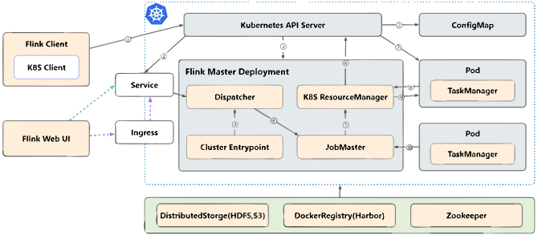

[Flink on K8S 在网易传媒的落地实践](http://blog.itpub.net/28285180/viewspace-2954164)

Flink的HistoryServer可以使用本地文件系统。默认情况下，Flink的HistoryServer会将历史作业的日志和状态信息存储在本地文件系统中。

如果您没有搭建Hadoop集群，可以在Flink配置文件中设置historyserver.archive.fs参数，将其指定为本地文件系统路径。例如，可以在flink-conf.yaml文件中添加以下配置：

historyserver.archive.fs: file:///path/to/local/directory

其中，/path/to/local/directory是本地文件系统中的目录路径。

需要注意的是，使用本地文件系统存储历史作业的日志和状态信息可能会存在一些限制，例如存储空间有限、数据备份不方便等。如果您需要更好的可靠性和可扩展性，建议您搭建Hadoop集群，并将历史作